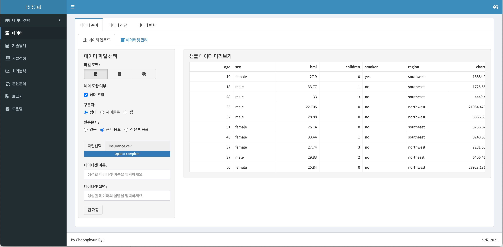
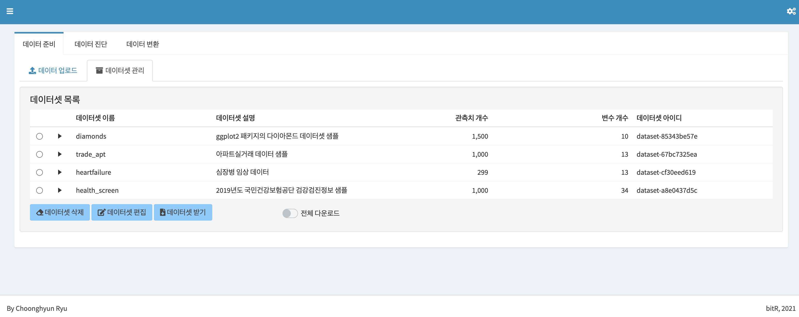
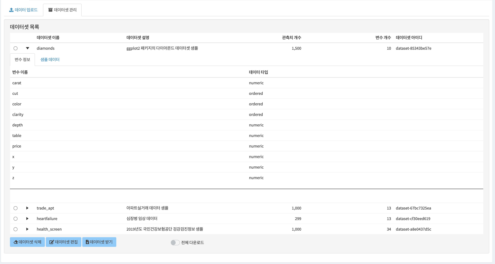
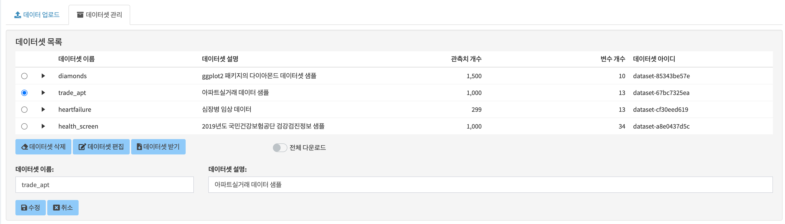
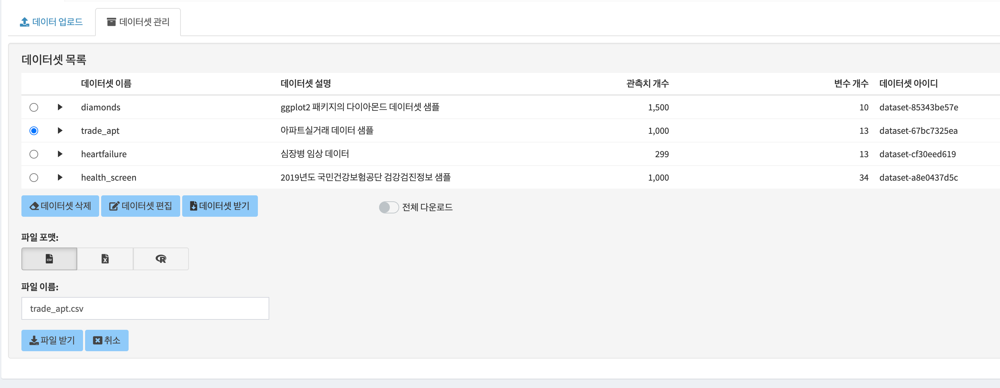
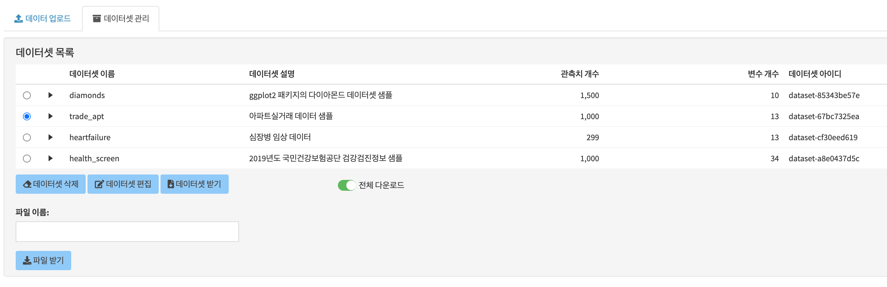

```{r setup, echo=FALSE, cache=FALSE}
library(shiny)
library(htmltools)
```


```{r, preface, echo=FALSE}
div(class = "preface", 
    h4("들어가기"),
    "분석을 수행할 데이터 파일을 BitStat에 업로드하는 방법을 다룹니다.", br(),
    "업로드된 데이터셋을 편집, 삭제, 다운로드하는 등의 관리 기능도 배웁니다. ")
```

<br>

# 데이터 준비 기능
데이터 준비는 **데이터 업로드**와 **데이터셋 관리** 기능을 제공합니다.

## 데이터 업로드하기
분석할 데이터 파일을 분석하기 위해서 BitStat에 업로드합니다.

현재 지원하는 데이터 파일은 다음과 같습니다.

* CSV[^1] 파일
    * 컴마로 컬럼을 구분하는 텍스트 파일
    * TSV(탭문자로 컬럼을 구분한) 파일 등 화이트 스페이스로 컬럼을 구분한 파일도 지원
    * 세미콜론(;)으로 구분하는 텍스트 파일도 지원
* EXCEL 파일
* R 데이터 파일

[^1]: CSV는 Comman-Seperated Values의 약어

BitStat를 구동하면 다음과 같은 데이터 업로드 화면이 출력됩니다. 왼쪽 메뉴의 데이터를 클릭해도 해당 화면이 출력됩니다.



### 파일 포맷 선택
파일 포맷을 선택하기 위해서는 CSV 파일, EXCEL 파일, R 데이터 파일을 의미하는 아이콘으로 표현한 `파일 포맷` 레디오 버튼의 아이콘 이미지를 클릭합니다.
기본값은 CSV 파일로 선택되어 있습니다.

레디오 버튼의 값이 바뀔때마다 다이얼로그 화면의 위젯이 바뀝니다. 이것은 파일의 종류별로 사용자에게 입력받을 정보에 차이가 있기 때문입니다.

### 헤더 포함여부 선택
CSV 파일과 EXCEL 파일의 경우에는 데이터에 첫째 줄이 헤더인지 헤더가 아닌지를 알려줘야 합니다. `헤더 포함 여부` 체크박스에 헤더 포함여부를 선택합니다. 기본값은 체크되어 있습니다.

`헤더 포함 여부`를 체크하고 해제함에 따라 오른쪽 `샘플 데이터 미리보기`의 내용이 바뀝니다. 그러므로 원하는 결과가 미리보기에 출력되도록 값을 선택합니다.

### 구분자 선택
`구분자` 레디오 버튼은 파일 포맷에서 CSV 파일을 선택했을 때 나타납니다. 즉, 파일에서 컬럼을 구분하는 구분자(seperator)를 선택합니다. 기본값은 CSV 파일을 의미하는 컴마가 선택됩니다.

`헤더 포함여부`와 마찬가지로 원하는 결과가 미리보기에 출력되도록 값을 선택합니다.

### 인용문자 선택
CSV 파일의 경우에는(TSV, 세미콜론 구분 파일 포함) 한 가지 이슈가 있습니다. 컬럼의 데이터 중에서 구분자로 사용하는 컴마(탭, 세미콜론)이 포함되어 있을 경우에는 데이터가 정상적으로 업로드 되지 않습니다. 어떤 것이 데이터의 컴마이고 어떤 것이 구분자로서의 컴마인지 알 수 없기 때문입니다. 이 경우에는 인용 문자로 컬럼 데이터를 감싸서 인용문자 안에 포함된 구분자 문자가 구분자가 아님을 알려 줘야 합니다. 이것은 특정 문자를 사용해서 컬럼을 구분하는 파일을 공유하는 사람들과 관련 프로그램에서 따르는 암묵적인 룰입니다.

만약 인용문자를 데이터에 포함된 구분자를 무효화하기 위해 인용문자를 사용했을 경우에는 `인용문자` 레디오 버튼에서 해당 인용문자를 선택합니다.

<br>
```{r, sol-1, echo=FALSE}
div(class = "bg-blue", 
    h4(icon("lightbulb", style = "margin-right: 5px;"), 
       "솔루션", style = "margin-bottom: 10px; margin-top: 0px;"), 
    "특정 컬럼에 문장과 같은 텍스트 데이터가 있을 경우에는 데이터 파일을 만들 때, 해당 컬럼은 인용문자로 감싸주는 것이 필요합니다. 이 경우에는 `인용문자` 레디오 버튼을 사용하세요.")
```
<br>

### 대상 시트번호 선택
EXCEL 파일의 경우에는 업로드할 데이터가 포함된 시트번호를 지정해야 한다. `대상 시트번호` 숫자 입력기는 데이터가 포함된 시트의 번호를 선택합니다.

### 파일 선택
파일의 특성을 선택한 후, `파일선택`을 눌러 사용자 컴퓨터에 있는 업로드할 파일을 선택합니다. 

데이터 파일 이름을 선택하면 자동으로 몇 건의 데이터 파일을 읽어 오른쪽의 `샘플 데이터 미리보기`에 표시됩니다. 결과에 따라 파일의 특성을 선택하는 입력 위젯을 바꿔서 원하는 결과가 `샘플 데이터 미리보기`에 표현되도록 유도합니다.  

### 데이터셋의 메타정보 입력
`샘플 데이터 미리보기`에 표현된 결과가 정상이라면, BitStat에 저장할 데이터셋의 정보를 기술합니다.

#### 데이터셋 이름
`데이터셋 이름` 텍스트 입력기에 BitStat에서 불려질 데이터셋 이름을 기술합니다. 데이터셋 이름은 중복을 허용하지만, 가급적 유일값이어야 합니다.

#### 데이터셋 설명
`데이터셋 설명` 텍스트 입력기에 해당 데이터셋을 설명하는 내용을 입력합니다. 가급적 상세하게 입력하는 것이 나중에 데이터를 유추하는데 도움이 됩니다.

### 데이터 업로드 하기
데이터셋의 메타정보를 입력한 후 `저장` 버튼을 눌러 데이터 파일을 BitStat에 데이터셋으로 저장합니다.


## 데이터 관리하기
BitStat은 분석할 데이터 파일이 업로된 후에 데이터셋을 관리하는 몇 가지 기능을 제공합니다.

현재 지원하는 데이터 관리 기능은 다음과 같습니다.

* 데이터셋 살펴보기
    * 데이터 건수, 변수 개수 및 데이터셋 이름, 설명 보기
    * 변수 이름과 데이터 타입
    * 샘플 데이터 보기
* 데이터셋 변경
    * 데이터셋 이름, 설명 변경
* 데이터셋 삭제
* 데이터셋 다운로드
    * CSV 파일, EXCEL 파일, R 데이터 파일
* 모든 데이터셋 다운로드
    * R 데이터 파일

### 데이터셋 살펴보기
`데이터셋 관리` 탭을 누르면 다음과 같은 `데이터셋 목록` 화면으로 전환합니다.



`데이터셋 목록`은 업로드된 데이터셋의 목록을 보여줍니다. 여기에는 데이터셋 이름, 사령, 관측치 개수, 변수 개수 및 데이터셋 아이디를 포함합니다. 그리고 데이터셋 이름의 삼각형을 클릭하면, 다음 그림처럼 `변수 정보`와 `샘플 데이터`를 보여줍니다. 탭을 눌러 `변수 정보`와 `샘플 데이터`를 조회할 수 있습니다.



### 데이터셋 삭제하기
만약에 업로드된 데이터셋이 필요가 없어질 경우에는 해당 데이터셋 이름 옆의 레디오 버튼을 선택한 후, `데이터셋 삭제` 버튼을 눌러 해당 데이터셋을 제거합니다. 


### 데이터셋 편집하기
데이터셋의 이름이나 설명 내용을 수정할 필요가 있을 경우에는 데이터셋 이름 옆의 레디오 버튼을 선택한 후, `데이터셋 편집` 버튼을 누릅니다.  그러면 다음처럼 데이터셋 편집 화면이 나타납니다. 이 화면에서 원하는 정보로 변경 후 `수정` 버튼을 누르면 해당 정보가 변경됩니다. 



### 데이터셋 다운로드하기
데이터셋을 다운로드하려면 데이터셋 이름 옆의 레디오 버튼을 선택한 후, `데이터셋 받기` 버튼을 누릅니다.  그러면 다음처럼 데이터셋 다운로드 화면이 나타납니다. 이 화면에서 다운로드할 파일의 포맷, 파일이름을 선택한 후 `파일받기` 버튼을 누르면 해당 데이터셋을 다운로드합니다. 



### 모든 데이터셋 다운로드하기
경우에 따라서는 업로드한 모든 데이터셋을 다운로드할 필요가 있습니다. 이 경우에는 `전체 다운로드` 버튼을 누릅니다.  그러면 다음처럼 전체 데이터셋 다운로드 화면이 나타납니다. 이 화면에서 다운로드할 파일이름을 선택한 후 `파일받기` 버튼을 누르면 해당 전체 데이터셋이 R 데이터 파일로 다운로드됩니다. 



