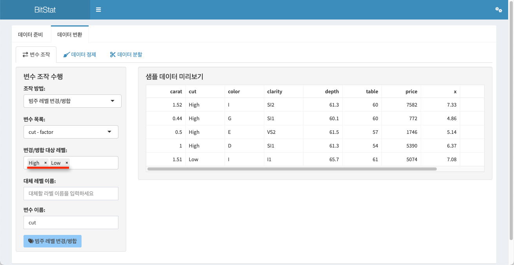

```{r setup, echo=FALSE, cache=FALSE}
library(shiny)
library(htmltools)
```


```{r, preface, echo=FALSE}
div(class = "preface", 
    h4("들어가기"),
    "원시 데이터를 분석을 위한 데이터 구조로 변경하기 위한 여러 데이터 변환 방법을 다룹니다.", br(),
    "개별 변수 레벨에서의 데이터 변환과 데이터 정제 및 데이터를 분할하는 방법을 설명합니다.")
```

<br>

## 데이터 변환 기능

`데이터 변환` 메뉴에서는 데이터 셋의 개별 변수 레벨에서의 각종 데이터 변환을 수행합니다. 그리고 전체 데이터 셋을 정제하고, 예측 모델을 만들기 위해서 데이터를 분할합니다.

- 변수 조작
- 데이터 정제
- 데이터 분할

### 변수 조작

데이터 셋의 개별 변수 레벨에서의 각종 데이터 변환을 수행합니다.

변수 조작 기능은 **데이터 > 데이터 변환 > 변수조작**의 메뉴 체계로 접근합니다.

변수 조작은 개별 변수에 대해서 다음의 작업을 수행합니다.

- 이름 변경
- 형 변환
- 변수 삭제
- 범주 레벨 순서변경
- 범주 레벨 변경/병합
- 변수변환
- 비닝

<br>

#### 이름 변경

변수의 이름을 변경하는 기능입니다.

다음과 같은 조작으로 `diamonds` 데이터 셋의 변수 `x`를 `x_size`로 변경해 보겠습니다.

1. `조작방법:` `selectInput` 입력 위젯에서 `이름변경`을 선택합니다.
2. `변수 목록:` `selectInput` 입력 위젯에서 `x - numeric`을 선택합니다.
    - 변수 목록은 **변수 이름 + 변수 데이터 형**으로 정의됩니다.
3. `수정 변수 이름:` `textInput` 입력 위젯에서 `x_size`를 입력합니다.

위 설정을 입력하면 다음과 같은 화면을 볼 수 있습니다.


<br>

`변수이름변경` 버튼을 누르면 다음처럼 변수 `x`가 `x_size`로 변경됩니다.


<br>

#### 형 변환

변수의 데이터 형을 변경하는 기능입니다. 데이터 형은 R에서 지원하는 다음 형들간의 변환을 지원합니다.

- 범주형
    - factor
- 연속형
    - numeric
- 정수형
    - integer
- 문자형
    - character
- 날짜
    - Date

다음과 같은 조작으로 `heartfailure` 데이터 셋에서 데이터 형이 문자형인 변수 `death_event`의 형을 범주형으로 변경해봅니다.

1. `조작방법:` `selectInput` 입력 위젯에서 `형 변환`을 선택합니다.
2. `변수 목록:` `selectInput` 입력 위젯에서 `death_event - character`를 선택합니다.
3. `변경 데이터 형:` `selectInput` 입력 위젯에서 `범주형으로`를 선택합니다.
    - 다음과 같은 값을 선택할 수 있습니다.
        - `범주형으로`
        - `연속형으로`
        - `정수형으로`
        - `문자형으로`
        - `날짜(Y-M-D)로`
4. `변환 변수 접미어:` `textInput` 입력 위젯에서 `flag`를 입력합니다.
    
위 설정을 입력하면 다음과 같은 화면을 볼 수 있습니다.

우측 정보 화면에서의 `형 변환 전 데이터 요약`은 문자형에 대한 요약 내용입니다.
그리고 `형 변환 후 데이터 요약`은 형이 변환되었음을 전제로 한 범주형에 대한 요약 내용으로 돗수분포를 보여줍니다.


<br>

`변수 형 변환` 버튼을 누르면 다음처럼 변수 `death_event`가 형 변환된 `death_eventflag` 변수가 추가됩니다.

`death_eventflag`는 범주형 변수이기 때문에, `형 변환 전 데이터 요약`은 범주형에 대한 요약으로 돗수분포가 출력됩니다.

**`만약 변환 변수 접미어:`의 값을 입력하지 않으면, 새로운 변수가 생성되지 않고 기존 변수 이름으로 형 변환이 수행됩니다. 기존 변수를 훼손하지 않고 싶다면 반드시 `만약 변환 변수 접미어:`에 값을 입력해서 새로운 변수를 생성해야 합니다.**


<br>

#### 변수 삭제

데이터 셋에서 불필요한 변수를 제거하는 기능입니다.

다음과 같은 조작으로 `heartfailure` 데이터 셋의 변수 `death_eventflag`를 제거해 보겠습니다.

1. `조작방법:` `selectInput` 입력 위젯에서 `변수 삭제`를 선택합니다.
2. `변수 목록:` `selectInput` 입력 위젯에서 `death_eventflag - factor`를 선택합니다.

위 설정을 입력하면 다음과 같은 화면을 볼 수 있습니다.


<br>

`변수 삭제` 버튼을 누르면 다음처럼 데이터 셋에서 변수 `death_eventflag`가 제거됩니다.


<br>

#### 범주 레벨 순서변경

범주형 변수만 지원하는 기능으로, 범주형 데이터의 레벨(수준, levels)의 순서를 변경합니다. 이 기능은 범주형 데이터(factor)를 순서 범주형 데이터(ordered factor)로 변경합니다.

이 기능의 설명을 위해서 `heartfailure` 데이터 셋의 문자형 변수인 `death_event`를 범주형으로 형 변환을 수행해 두었습니다.

`범주 레벨 순서변경` 기능에서 `death_event`를 선택하면 다음 그림처럼 `범주 레벨 순서변경:`의 순서가 `No`, `Yes`의 순서로 표현되어 있습니다.


<br>

다음과 같은 조작으로 `heartfailure` 데이터 셋의 변수 `death_event`의 범주 레벨의 순서를 변경합니다.

1. `조작방법:` `selectInput` 입력 위젯에서 `범주 레벨 순서변경`를 선택합니다.
2. `변수 목록:` `selectInput` 입력 위젯에서 `death_event - factor`를 선택합니다.
3. `범주 레벨 순서변경:` `selectizeInput` 입력 위젯에서 **마우스의 드래그 드롭**으로 **`No`, `Yes`의 순서를 `Yes`, `No`로 변경**합니다.

위 설정을 입력하면 다음과 같은 화면을 볼 수 있습니다. `범주 레벨 순서변경:`의 순서가 `Yes`, `No`의 순서로 표현되어 있습니다.


<br>

`범주 레벨 순서변경` 버튼을 누르면 다음처럼 데이터 셋에서 변수 `death_event`의 범주 레벨의 순서가 `Yes`, `No`로 변경됩니다. 그리고 데이터 형이 순서 범주형 데이터인 `ordered factor` 변경되었음을 확인할 수 있습니다.


<br>

#### 범주 레벨 변경/병합

범주 레벨을 변경하거나 병합하는 기능을 수행합니다.

먼저 다음의 시나리오로 범주 레벨을 변경해 보겠습니다.

- `heartfailure` 데이터 셋의 변수 `death_event`의 범주 레벨 변경
    - `Yes`를 `Death`로 변경
    - `No`를 `Alive`로 변경

`범주 레벨 변경/병합` 기능에서 `death_event`를 선택하면 다음 그림처럼 `변경/병합 대상 레벨:`에 `Yes`, `No`의 순서로 레벨이 표현되어 있습니다. 그런데 **위젯을 살펴보면, 레벨의 오른쪽에 "x" 표시간 되어 있는 것을 볼수 있습니다.**


<br>

범주 레벨 변경은 다음처럼 2 단계로 진행합니다. 

1. `Yes`를 `Death`로 변경
2. `No`를 `Alive`로 변경

<br>

##### `Yes`를 `Death`로 변경

다음과 같은 조작으로 `heartfailure` 데이터 셋의 변수 `death_event`의 범주 레벨을 변경합니다.

1. `조작방법:` `selectInput` 입력 위젯에서 `범주 레벨 변경/병합`를 선택합니다.
2. `변수 목록:` `selectInput` 입력 위젯에서 `death_event - ordered`를 선택합니다.
3. `변경/병합 대상 레벨:` `selectizeInput` 입력 위젯에서 **`Yes`를 클릭해서 제거합니다.**
    - **제거된 `Yes`가 변경할 대상입니다. 남아 있는 `No`가 변경 대상이 아닙니다.**
4. `대체 레벨 이름:` `textInput` 입력 위젯에서 `Death`를 입력합니다.      

위 설정을 입력하면 다음과 같은 화면을 볼 수 있습니다. `변경/병합 대상 레벨:`에는 `No`가 남아있고, `대체 레벨 이름:`에는 `Death`가 입력되어 있습니다. 


<br>

`범주 레벨 변경/병합` 버튼을 누른 후 다시 범주 레벨 변경/병합으로 이동하면 다음처럼 `변경/병합 대상 레벨:`이 `Death`, `No`로 변경된 것을 확인할 수 있습니다. 그리고 데이터 형이 범주형 데이터인 `factor` 변경되었음을 확인할 수 있습니다.


<br>

##### `No`를 `Alive`로 변경

다음과 같은 조작으로 `heartfailure` 데이터 셋의 변수 `death_event`의 범주 레벨을 변경합니다.

1. `조작방법:` `selectInput` 입력 위젯에서 `범주 레벨 변경/병합`를 선택합니다.
2. `변수 목록:` `selectInput` 입력 위젯에서 `death_event - factor`를 선택합니다.
3. `변경/병합 대상 레벨:` `selectizeInput` 입력 위젯에서 **`No`를 클릭해서 제거합니다.**
    - **제거된 `No`가 변경할 대상입니다. 남아 있는 `Death`가 변경 대상이 아닙니다.**
4. `대체 레벨 이름:` `textInput` 입력 위젯에서 `Alive`를 입력합니다.      

위 설정을 입력하면 다음과 같은 화면을 볼 수 있습니다. `변경/병합 대상 레벨:`에는 `Death`가 남아있고, `대체 레벨 이름:`에는 `Alive`가 입력되어 있습니다. 


<br>

`범주 레벨 변경/병합` 버튼을 누른 후 다시 범주 레벨 변경/병합으로 이동하면 다음처럼 `변경/병합 대상 레벨:`이 `Death`, `Alive`로 변경된 것을 확인할 수 있습니다. 


<br>

`diamonds` 데이터 셋의 변수 `cut`은 **Fair < Good < Very Good < Premium < Ideal**의 순서를 갖는 수서 범주형(ordered factor)입니다. 우측으로 갈수록 다이아몬드 커팅 등급이 높습니다.

두번째로 다음의 시나리오로 범주 레벨을 병합해 보겠습니다.

- `diamonds` 데이터 셋의 변수 `cut`의 범주 레벨 변경
    - `Fair`, `Good`을 `Low`로 변경
    - `Very Good`, `Premium`, `Ideal`을 `High`로 변경

`범주 레벨 변경/병합` 기능에서 `cut`를 선택하면 다음 그림처럼 `변경/병합 대상 레벨:`에 `Fair`, `Good`, `Very Good`, `Premium`, `Ideal`의 순서로 레벨이 표현되어 있습니다. 


<br>

범주 레벨 변경은 다음처럼 2 단계로 진행합니다. 

1. `Fair`, `Good`을 `Low`로 변경
2. `Very Good`, `Premium`, `Ideal`을 `High`로 변경

<br>

##### `Fair`, `Good`을 `Low`로 변경

다음과 같은 조작으로 `diamonds` 데이터 셋의 변수 `cut`의 범주 레벨을 변경합니다.

1. `조작방법:` `selectInput` 입력 위젯에서 `범주 레벨 변경/병합`를 선택합니다.
2. `변수 목록:` `selectInput` 입력 위젯에서 `cut - ordered`를 선택합니다.
3. `변경/병합 대상 레벨:` `selectizeInput` 입력 위젯에서 **`Fair`, `Good`을 클릭해서 제거합니다.**
    - **제거된 `Fair`, `Good`가 변경할 대상입니다.**
4. `대체 레벨 이름:` `textInput` 입력 위젯에서 `Low`를 입력합니다.      

위 설정을 입력하면 다음과 같은 화면을 볼 수 있습니다. `변경/병합 대상 레벨:`에는 `Very Good`, `Premium`, `Ideal`이 남아있고, `대체 레벨 이름:`에는 `Low`가 입력되어 있습니다. 


<br>

`범주 레벨 변경/병합` 버튼을 누른 후 다시 범주 레벨 변경/병합으로 이동하면 다음처럼 `변경/병합 대상 레벨:`이 `Fair`, `Good`, `Low`로 변경된 것을 확인할 수 있습니다. 그리고 데이터 형이 범주형 데이터인 `factor` 변경되었음을 확인할 수 있습니다.


<br>

##### `Very Good`, `Premium`, `Ideal`을 `High`로 변경

다음과 같은 조작으로 `diamonds` 데이터 셋의 변수 `cut`의 범주 레벨을 변경합니다.

1. `조작방법:` `selectInput` 입력 위젯에서 `범주 레벨 변경/병합`를 선택합니다.
2. `변수 목록:` `selectInput` 입력 위젯에서 `cut - factor`를 선택합니다.
3. `변경/병합 대상 레벨:` `selectizeInput` 입력 위젯에서 **`Very Good`, `Premium`, `Ideal`를 클릭해서 제거합니다.**
    - **제거된 `Very Good`, `Premium`, `Ideal`가 변경할 대상입니다. 남아 있는 `Low`가 변경 대상이 아닙니다.**
4. `대체 레벨 이름:` `textInput` 입력 위젯에서 `High`를 입력합니다.      

위 설정을 입력하면 다음과 같은 화면을 볼 수 있습니다. `변경/병합 대상 레벨:`에는 `Low`가 남아있고, `대체 레벨 이름:`에는 `High`가 입력되어 있습니다. 


<br>

`범주 레벨 변경/병합` 버튼을 누른 후 다시 범주 레벨 변경/병합으로 이동하면 다음처럼 `변경/병합 대상 레벨:`이 `High`, `Low`로 변경된 것을 확인할 수 있습니다. 



<br>

#### 변수변환

변수 변환은 수치형 변수에 대해서 선형 변환을 수행하는 기능입니다. 변환에 적용할 함수는 다음과 같습니다.

`적용 함수:` `selectInput` 입력 위젯에서 다음의 적용 함수를 선택합니다.

- zscore
    - 표준정규분포 변환
- minmax
    - min-max 변환
- log
    - 로그변환
- log + 1
    - 로그 +1 변환
- sqrt
    - 제곱근 변환
- 1 / x
    - 1/x 변환
- x ^ 2
    - x^2 변환
- x ^ 3
    - x^3 변환

다음 그림은 `diamonds` 데이터셋의 수치변수인 `carat`을 `zscore`로 변환하기 위한 설정입니다. 아래의 `데이터 분포 비교` 시각화는 변환 전과 후의 데이터의 분포를 밀도함수로 미리 보여줍니다.

`변수변환` 버튼을 누르면 적용된 변환함수가 원 데이터에 적용되어 변환됩니다.


<br>

다음 그림은 `diamonds` 데이터셋의 수치변수인 `carat`에 `log` 함수를 적용하기 위한 설정입니다. 아래의 `데이터 분포 비교` 시각화를 보면 변환 전과 후의 분포의 모양이 다릅니다.


#### 비닝

TO-DO

## 데이터 정제

Not Develop

## 데이터 분할

Not Develop

