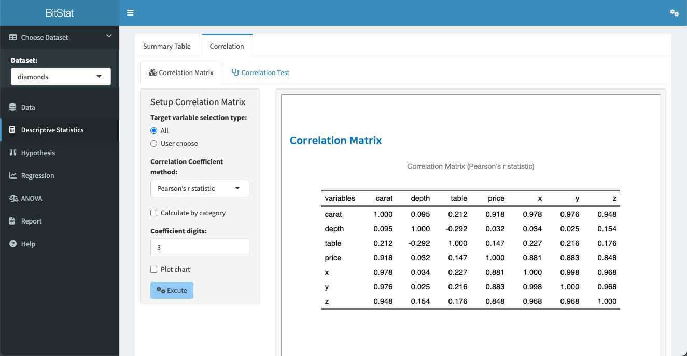
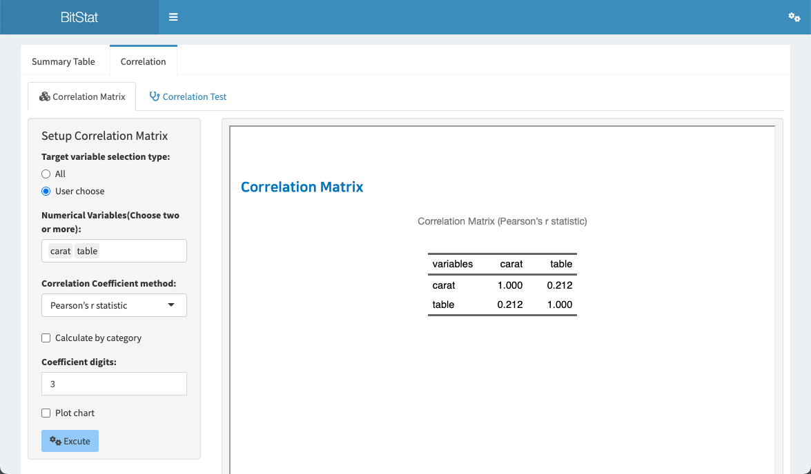
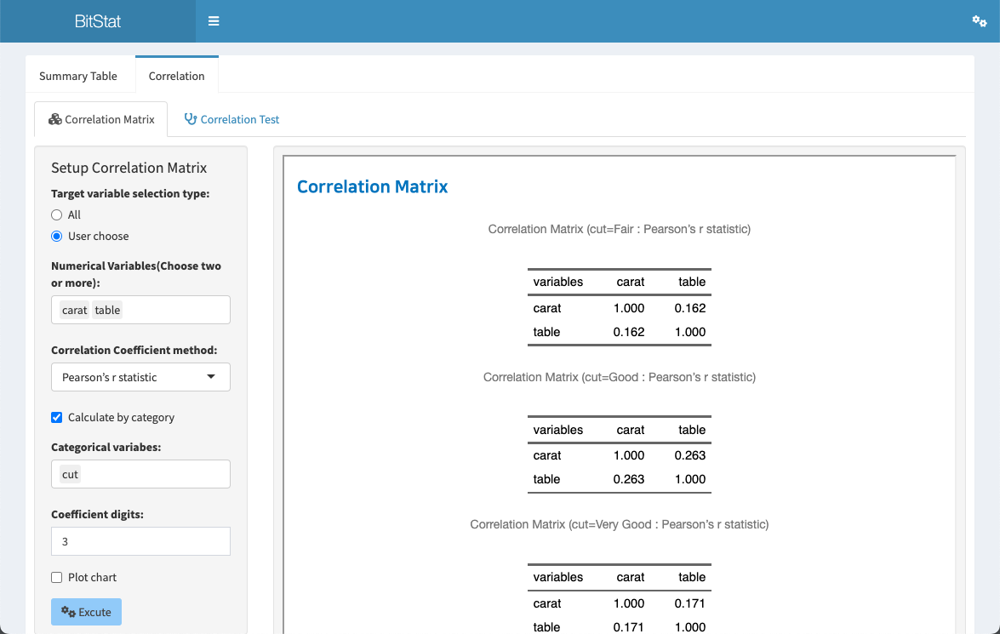
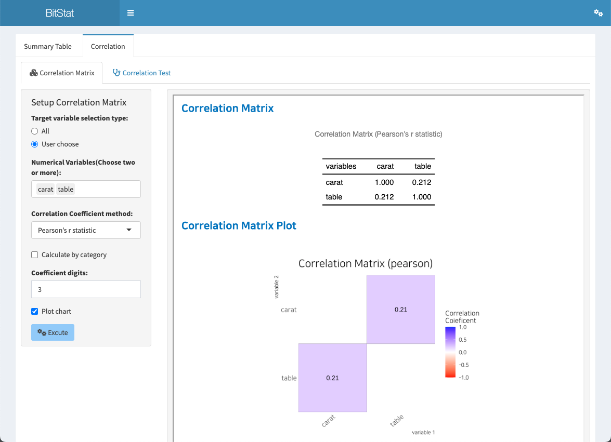
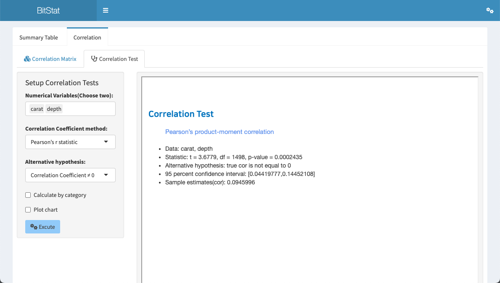
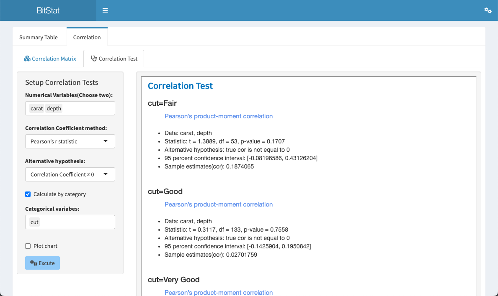
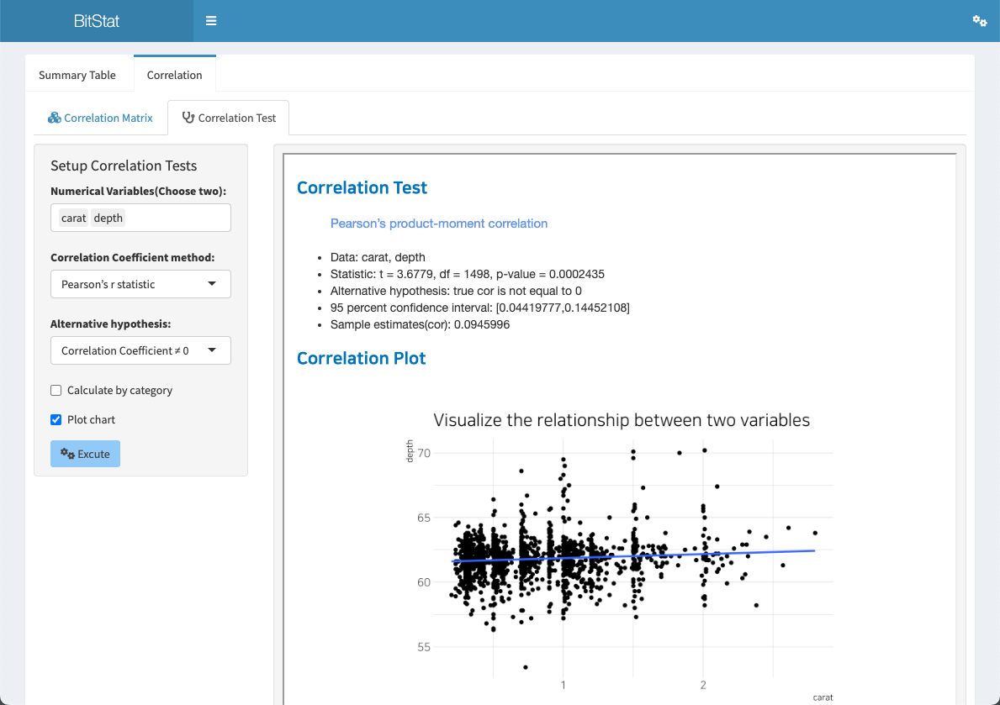

```{r setup, echo=FALSE, cache=FALSE}
library(shiny)
library(htmltools)
```


```{r, preface, echo=FALSE}
div(class = "preface", 
    h4("Preface"),
    "Analyze the correlation of numeric variables.", br(),
    "'Correlation' calculates the correlation matrix, visualizes the correlation matrix, and helps to easily understand the relationship of variables with correlation tests and correlation plots of two variables.")
```

<br>

## Fuction of Correlation

In the `Correlation` menu, **correlation matrix** of numerical variables and **correlation test** of two numerical variables are performed and a **scatter plot** is visualized.

- correlation matrix
- correlation test

### Correlation Matrix

Create correlation matrix of numeric variables and visualize correlation matrix plot.

The correlation matrix function is accessed through the menu system of **Descriptive Statistics > Correlation > Correlation Matrix**.

<br>

#### Input widget for calculating correlation matrix

- Target variable selection type:
    - Select one from `All` and `Custom` with the radio button.
    - All
        - By default, all numeric variables are selected for analysis.
    - User choose
        - The user selects a numeric variable to analyze.
        - If user selection is checked, 
        - a list box of `Numerical Variables(Choose two or more):` will appear.
- Numerical Variables(Choose two or more):
    - Appears only when `User choose` is specified in `Target variable selection type:`.
    - You can select more than one variable from any numeric variable.
- Correlation Coefficient method:
    - Select the type of correlation coefficient to be calculated.
    - Choose from `Pearson's r statistic`, `Kendall's tau statistic`, `Spearman's rho statistic`.
    - `Pearson's r statistic` is selected by default.
- Calculate by category
    - This function calculates the correlation matrix of numeric variables by grouping them by level of categorical variables.
    - Checking the check box widget will bring up the 'Categorical variables:' for categorical calculations.
- Categorical variables:
    - Select a categorical variable to group the correlation matrix of numeric variables by level of categorical variables. You can select one or more categorical variables.
- Coefficient digits:
    - Specifies the number of decimal places for the calculated correlation coefficient.
    - The default is 3, which is user-selectable.
- Plot chart
    - Select whether to output a `correlation matrix plot` together with the correlation matrix.
    - If the check box is checked, the plot is also output.

<br>

#### Basic correlation matrix output

The method of outputting the correlation matrix from the `Correlation Matrix` is introduced on the premise of selecting the 'diamonds' data from the `Dataset:` list box.

As the default setting of Descriptive Statistics > Correlation > Correlation Matrix, if you click the `Execute` button, the **Correlation Matrix** is output in the right result area.

These default settings are:

- Target variable selection type:
    - All
- Correlation Coefficient method:
    - `Pearson's r statistic`
- Coefficient digits:
    - 3



<br>

#### Correlation matrix with user selected variable

Instead of all numeric variables, the user can select a numeric variable to be output. This example selects two variables `caret` and `table`.

The settings for the correlation matrix are defined as follows.

- Target variable selection type:
    - User choose
- Numerical Variables(Choose two or more):
    - `caret`, `table`
- Coefficient digits:
    - 3
    
If executed under the above conditions, the following correlation matrix is output.



<br>

#### Correlation matrix by categorical variable

If you check the 'Calculate by category' check box, you can calculate the correlation matrix of the numeric variable for each level of the selected categorical variable.

Select the categorical variable `cut` from the `Categorical variables:` that appears by checking the `Calculate by category` check box as shown in the following figure.

The settings for the correlation matrix are defined as follows.

- Target variable selection type:
    - User choose
- Numerical Variables(Choose two or more):
    - `caret`, `table`
- Calculate by category
    - checked
- Categorical variables:  
    - `cut`
- Coefficient digits:
    - 3

When executed under the above conditions, the following aggregate correlation matrix is output.



<br>

#### Correlation matrix with visualization

A correlation matrix is a matrix structure of statistics composed of a combination of several numeric variables. Visualizing this structure makes it easier to understand the relationship between variables.

If you check the `Plot chart` check box, you can output a `correlation matrix plot` that can identify the relationship between numeric variables.

The following is the result when the `Plot chart` check box is checked. A plot similar to the composition printed on the correlation matrix is output.



<br>

### Correlation Test

A correlation test of two numerical variables is performed, and the relationship between the two variables is visualized based on a scatterplot.

The correlation test function is accessed through the menu system of **Descriptive Statistics > Correlation > Correlation Test**.

<br>

#### Input widget for correlation test

- Numerical Variables(Choose two):
    - You can select two variable from any numeric variable.
- Correlation Coefficient method:
    - Select the type of correlation coefficient to be calculated.
    - Choose from `Pearson's r statistic`, `Kendall's tau statistic`, `Spearman's rho statistic`.
    - `Pearson's r statistic` is selected by default.
- Alternative hypothesis:
    - An alternative hypothesis is established for the correlation test.
    - Select from `Correlation Coefficient ≠ 0`, `Correlation Coefficient < 0`, `Correlation Coefficient > 0`.
    - `Correlation Coefficient ≠ 0` is selected by default.  
- Calculate by category
    - This function calculates the correlation test of two numerical variables by grouping them by level of categorical variables.
    - Checking the check box widget will bring up the `Categorical variables:` for categorical calculations.
- Categorical variables:
    - Select a categorical variable to group the correlation test results of two numerical variables by level of the categorical variables. You can select one or more categorical variables.  
- Plot chart
    - Select whether to output a 'scatter plot' that can identify the relationship between two numerical variables along with the correlation test result.
    - If the check box is checked, the plot is also output.

<br>

#### Basic correlation test

If you click the `Execute` button as the default setting of Descriptive Statistics > Correlation > Correlation Test, **correlation test result** will be displayed in the right result area.

These default settings are:

- Numerical Variables(Choose two):
    - `caret`, `table`
- Correlation Coefficient method:  
    - `Pearson's r statistic`
- Alternative hypothesis:
    - `Correlation Coefficient ≠ 0` 
- Plot chart
    - unchecked



<br>

#### Correlation test by category

If the `Calculation by category` check box is checked, the correlation test of two numerical variables is performed for each level of the selected categorical variable.

Select the categorical variable `cut` from the `Categorical variables:` that appears by checking the `Calculate by category` check box as shown in the following figure.

The settings for the correlation test were defined as follows.

- Numerical Variables(Choose two):
    - `caret`, `table`
- Correlation Coefficient method:  
    - `Pearson's r statistic`
- Alternative hypothesis:
    - `Correlation Coefficient ≠ 0` 
- Calculate by category
    - Checked
- Categorical variables:
    - `cut`

If it is executed under the above conditions, the following correlation test result is output.



<br>

#### Correlation test with visualization

If you check the `Plot chart` check box, a `scatter plot` is output to determine the relationship between two numerical variables along with the correlation test result.

The following is the result when the `Plot chart` check box is checked.




