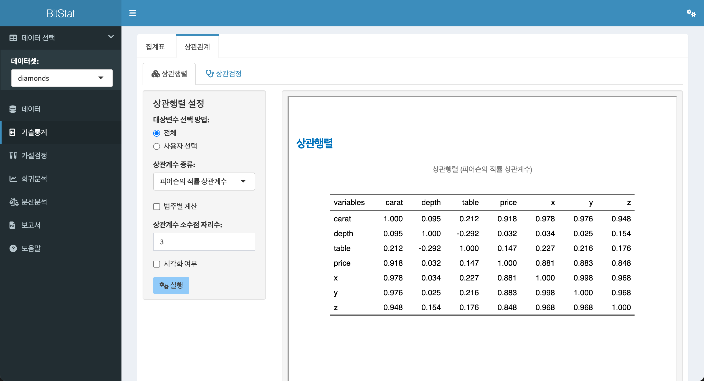
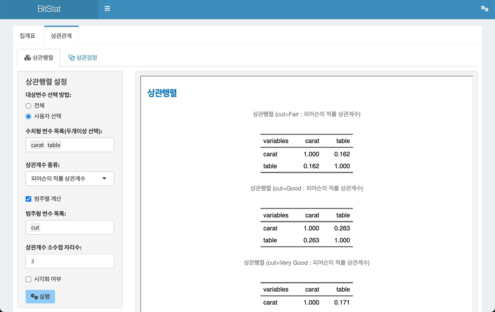
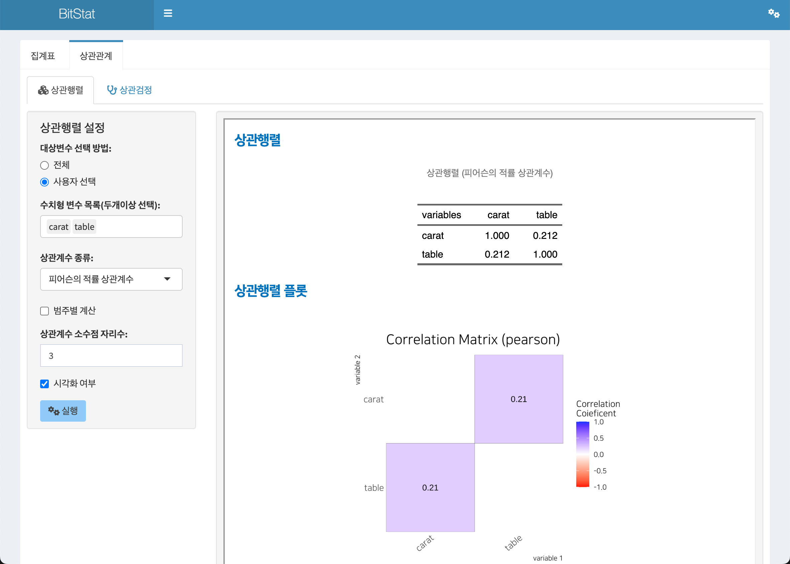
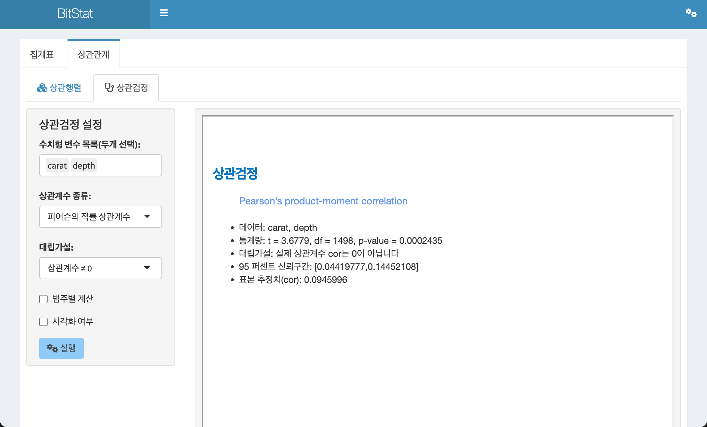
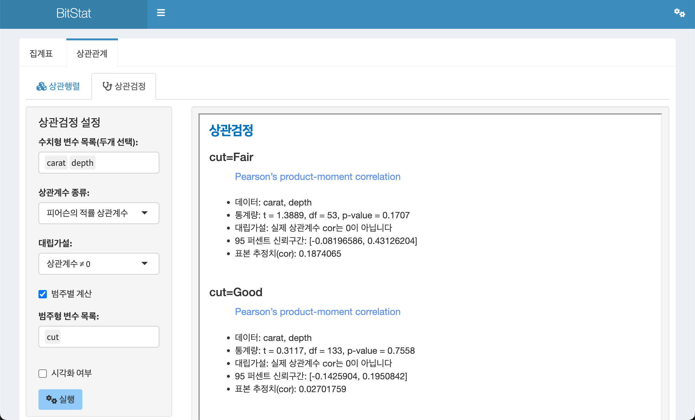
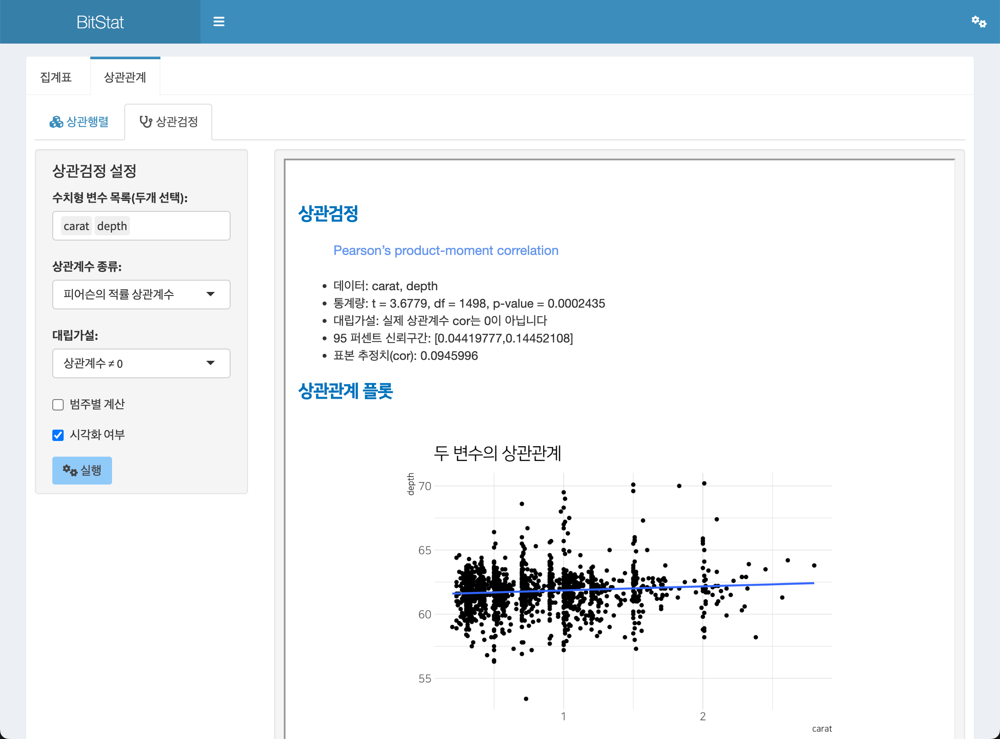

```{r setup, echo=FALSE, cache=FALSE}
library(shiny)
library(htmltools)
```


```{r, preface, echo=FALSE}
div(class = "preface", 
    h4("들어가기"),
    "수치형 변수의 상관관계를 분석합니다.", br(),
    "상관행렬을 구하고 상관행렬을 시각화하며, 상관검정과 두 변수의 상관관계 플롯으로 변수의 관계를 쉽게 파악할 수 있도록 도와줍니다.")
```

<br>

## 상관관계 기능

`상관관계` 메뉴에서는 수치형 변수의 **상관행렬**과 두 수치형 변수의 **상관검정**을 수행하고 **산점도**를 시각화합니다.

- 상관행렬(correlation matrix)
- 상관검정(correlation test)

### 상관행렬

수치형 변수들의 상관행렬(correlation matrix)을 작성하고, 상관행렬도(correlation matrix plot)를 시각화합니다.

상관행렬 기능은 **기술통계 > 상관관계 > 상관행렬**의 메뉴 체계로 접근합니다.

<br>

#### 상관행렬 계산을 위한 입력 위젯

- 대상변수 선택 방법:
    - 레디오 버튼으로 `전체`와 `사용자 선택`에서 하나를 선택합니다.
    - 전체
        - 기본 설정값으로 모든 수치형 변수를 분석 대상으로 선정합니다.
    - 사용자 선택
        - 사용자가 분석할 수치형 변수를 선택합니다.
        - 사용자 선택을 체크하면, 
        - `수치형 변수 목록(두개이상 선택):` 리스트 박스가 나타납니다.
- 수치형 변수 목록(두개이상 선택):
    - `대상변수 선택 방법:`에서 `사용자 선택`을 지정했을 때만 나타납니다.
    - 모든 수치형 변수에서 두개 이상의 변수를 선택할 수 있습니다.
- 상관계수 종류:
    - 계산할 상관계수의 종류를 선택합니다.
    - `피어슨의 적률 상관계수`, `켄달의 적률 상관계수`, `스피어만의 적률 상관계수`에서 선택합니다.
    - `피어슨의 적률 상관계수`가 기본 선택됩니다.
- 범주별 계산
    - 수치형 변수의 상관행렬을 범주형 변수들의 레벨별로 그룹핑하여 계산하는 기능입니다.
    - 체크박스 위젯을 체크하면 범주별 계산을 위한 `범주형 변수 목록:`이 나타납니다.
- 범주형 변수 목록:
    - 수치형 변수들의 상관행렬을 범주형 변수들의 레벨별로 그룹핑할 범주형 변수를 선택합니다. 하나 이상의 범주형 변수를 선택할 수 있습니다.
- 상관계수 소수점 자리수:
    - 계산된 상관계수의 소수점 이하 자리수를 지정합니다.
    - 기본값은 3이며, 사용자가 선택할 수 있습니다.
- 시각화 여부
    - 상관행렬와 함께, `상관행렬도(correlation matrix plot)`을 함께 출력할지의 여부를 선택합니다.
    - 체크박스를 체크하면 플롯도 함께 출력됩니다.

<br>

#### 기본 상관행렬 출력

`상관행렬`에서 상관행렬을 출력하는 방법은 `데이터셋:` 리스트박스에서 `diamonds` 데이터를 선택을 전제로 소개합니다.

기술통계 > 상관관계 > 상관행렬의 기본 설정으로 `실행` 버튼을 클릭하면 오른쪽 결과 영역에 **상관행렬**이 출력됩니다.

이 기본 설정은 다음과 같습니다.

- 대상변수 선택 방법:
    - 전체
- 상관계수 종류:
    - `피어슨의 적률 상관계수`
- 통계량 소수점 자리수:  
    - 3



<br>

#### 사용자 변수선택 상관행렬 출력

전체 수치형 변수가 아닌, 사용자가 출력할 수치형 변수를 선택할 수 있습니다. 이 예제에서는 `caret`, `table` 두 변수를 선택합니다.

상관행렬을 위한 설정은 다음과 같이 정의되었습니다.

- 대상변수 선택 방법:
    - 사용자 선택
- 수치형 변수 목록(두개이상 선택):
    - `caret`, `table`
- 통계량 소수점 자리수:  
    - 3
    
상기 조건으로 실행하면 다음과 같은 상관행렬이 출력됩니다.


<br>

#### 범주별 수치형 변수 상관행렬 출력

`범주별 계산` 체크 박스를 체크하면, 선택한 범주형 변수의 수준(levels)별로 수치형 변수의 상관행렬을 계산할 수 있습니다.

다음 그림처럼 `범주별 계산` 체크 박스를 체크하여 나타난 `범주형 변수 목록:`에서 범주형 변수인 `cut`을 선택합니다.

상관행렬을 위한 설정은 다음과 같이 정의되었습니다.

- 대상변수 선택 방법:
    - 사용자 선택
- 수치형 변수 목록(두개이상 선택):
    - `caret`, `table`
- 범주별 계산
    - 체크
- 범주형 변수 목록:    
    - `cut`
- 통계량 소수점 자리수:  
    - 3

상기 조건으로 실행하면 다음과 같은 집계 상관행렬이 출력됩니다.



<br>

#### 시각화와 함께 상관행렬 출력

상관행렬은 여러 수치형 변수의 조합으로 구성된 통계량의 행렬구조입니다. 이 구조를 시각화하면 좀 더 쉽게 변수들의 관계를 파악할 수 있습니다.

`시각화 여부` 체크 박스를 체크하면, 수치형 변수들의 관계를 파악할 수 있는 `상관행렬도(correlation matrix plot)`을 함께 출력할 수 있습니다.

다음은 `시각화 여부` 체크 박스를 체크한 경우의 결과입니다. 상관행렬에 출력된 구도와 유사한 플롯이 출력됩니다.



<br>

### 상관검정

두 수치형 변수의 상관검정을 수행하고, 두 변수의 관계를 산점도 기반으로 시각화합니다.

상관검정 기능은 **기술통계 > 상관관계 > 상관검정**의 메뉴 체계로 접근합니다.

<br>

#### 상관검정을 위한 입력 위젯

- 수치형 변수 목록(두개 선택):
    - 모든 수치형 변수 중에서 상관관계를 검정할 두개의 변수를 선택합니다.
- 상관계수 종류:
    - 계산할 상관계수의 종류를 선택합니다.
    - `피어슨의 적률 상관계수`, `켄달의 적률 상관계수`, `스피어만의 적률 상관계수`에서 선택합니다.
    - `피어슨의 적률 상관계수`가 기본 선택됩니다.
- 대립가설:
    - 상관검정을 위한 대립가설(alternative hypothesis)을 설정합니다.
    - `상관계수 ≠ 0`, `상관계수 < 0`, `상관계수 > 0`에서 선택합니다.
    - `상관계수 ≠ 0`가 기본 선택됩니다.    
- 범주별 계산
    - 두 수치형 변수의 상관검정을 범주형 변수들의 레벨별로 그룹핑하여 계산하는 기능입니다.
    - 체크박스 위젯으로 체크하면 범주별 계산을 위한 `범주형 변수 목록:`이 나타납니다.
- 범주형 변수 목록:
    - 두 수치형 변수의 상관검정 결과를 범주형 변수들의 레벨별로 그룹핑할 범주형 변수를 선택합니다. 하나 이상의 범주형 변수를 선택할 수 있습니다.    
- 시각화 여부
    - 상관검정 결과와 함께, 두 수치변수의 관계를 파악할 수 있는 `산점도(scatter plot)`을 함께 출력할지의 여부를 선택합니다.
    - 체크박스를 체크하면 플롯도 함께 출력됩니다.

<br>

#### 기본 상관검정 출력

기술통계 > 상관관계 > 상관검정의 기본 설정으로 `실행` 버튼을 클릭하면 오른쪽 결과 영역에 **상관검정 결과**가 출력됩니다.

이 기본 설정은 다음과 같습니다.

- 수치형 변수 목록(두개 선택):
    - `caret`, `depth`
- 상관계수 종류:    
    - `피어슨의 적률 상관계수`
- 대립가설:
    - `상관계수 ≠ 0`
- 시각화 여부
    - 미 체크



<br>

#### 범주별 상관검정

`범주별 계산` 체크 박스를 체크하면, 선택한 범주형 변수의 수준(levels)별로 두 수치형 변수의 상관검정을 수행합니다.

다음 그림처럼 `범주별 계산` 체크 박스를 체크하여 나타난 `범주형 변수 목록:`에서 범주형 변수인 `cut`을 선택합니다.

상관검정을 위한 설정은 다음과 같이 정의되었습니다.

- 수치형 변수 목록(두개 선택):
    - `caret`, `depth`
- 상관계수 종류:    
    - `피어슨의 적률 상관계수`
- 대립가설:
    - `상관계수 ≠ 0`
- 범주별 계산
    - 체크
- 범주형 변수 목록:    
    - `cut`

상기 조건으로 실행하면 다음과 같은 상관검정 결과가 출력됩니다.



<br>

#### 시각화를 포함한 상관검정

`시각화 여부` 체크 박스를 체크하면, 상관검정 결과와 함께 두 수치변수의 관계를 파악할 수 있는 `산점도(scatter plot)`를 출력합니다.

다음은 `시각화 여부` 체크 박스를 체크한 경우의 결과입니다. 




