```{r setup, echo=FALSE, cache=FALSE}
library(shiny)
library(htmltools)
```


```{r, preface, echo=FALSE}
div(class = "preface", 
    h4("Preface"),
    "It covers how to aggregate uploaded or stored data.", br(),
    "Describes how to perform summary aggregation and visualization by characteristics of numeric and categorical variables.")
```

<br>

## Fuction of Summary Table

In the `Summary Table` menu, numerical variables are aggregated into **statistical tables**, and categorical variables are aggregated into **frequency tables** and **contingency tables**. And it is visualized to easily understand the distribution of variables.

- Statistical Table of Numerical Variables
- Frequency Table of Categorical Variables
- Contingency Table of Categorical Variables

### Statistical Table of Numerical Variables

Create statistical tables of numeric variables and visualize their distributions.

The summary table function is accessed through the menu system of **Descriptive Statistics > Summary Table > Statistical Table of Numerical Variables**.

<br>

#### Input widget for aggregation

- Target variable selection type:
    - Select one from `All` and `Custom` with the radio button.
    - All
        - By default, all numeric variables are selected for analysis.
    - User choose
        - The user selects a numeric variable to analyze.
        - If user selection is checked, 
        - a list box of `Numerical Variables(Choose one or more):` will appear.
- Numerical Variables(Choose one or more):
    - Appears only when `User choose` is specified in `Target variable selection type:`.
    - You can select one or more variables from any numeric variable.
- Statistics method:
    - Select the statistics to output to the summary table.
    - Choose from `missing`, `mean`, `standard deviation`, `skeweness`, `kurtosis`, `observation`, `SEM`, `IQR`.
    - `mean`, `standard deviation`, `skeweness`, `kurtosis` are selected by default.
- Quantiles method:
    - Select the quantiles to output to the summary table.
    - `min`, `Q1`, `median`, `Q3`, `max`, `1%th`, `5%th`, `10%th`, `20%th`, `30%th`, `40%th`, `60%th`, `70%th`, `80%th`, `90%th`, `95%th`, `99%th`에서 선택합니다.
    - `min`, `Q1`, `median`, `Q3`, `max` are selected by default.
- Calculate by category
    - This is a function that calculates a statistical table of numeric variables by grouping them by level of categorical variables.
    - Checking the check box widget will bring up the 'Categorical variables:' for categorical calculations.
- Categorical variables:
    - This function calculates the ssummary table of numeric variables by grouping them by level of categorical variables.
- Statistics digits:
    - Specifies the number of decimal places for the calculated statistics.
    - The default is 3, which is user-selectable.
- Plot chart
    - Select whether to output a 'density plot' that can identify the distribution of numerical variables along with the statistical table.
    - If the check box is checked, the plot is also output.

<br>

#### Statistical table by default setting

Here, outputting a statistical table from the `Statistical Table of Numerical Variables` is assuming that `diamonds` data is selected in the `Dataset:` list box.

As the default setting of Descriptive Statistics > Summary Table > Statistical Table of Numerical Variables, if you click the `Execute` button, the **statistical table** is output in the right result area.

These default settings are:

- Target variable selection type:
    - All
- Statistics method:
    - `mean`, `standard deviation`, `skeweness`, `kurtosis`
- Quantiles method:
    - `min`, `Q1`, `median`, `Q3`, `max`
- Statistics digits:
    - 3

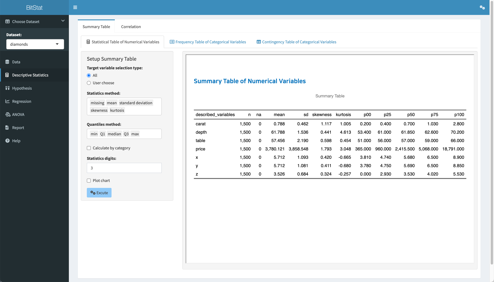

<br>

#### Statistical table by user-selected selection

Instead of all numeric variables, the user can select a numeric variable. This example selects the variables `caret`, `depth`, `table` and `price`.

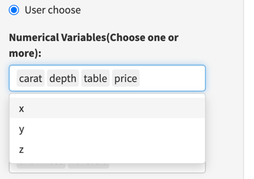
<br>

The settings for the statistical table are now defined as follows:

- Target variable selection type:
    - User choose
- Numerical Variables(Choose one or more):
    - `caret`, `depth`, `table`, `price`
- Statistics method:
    - `mean`, `standard deviation`, `skeweness`, `kurtosis`
- Quantiles method:
    - `min`, `Q1`, `median`, `Q3`, `max`
- Statistics digits:
    - 3
  
When executed under the above conditions, the following statistical table is output.

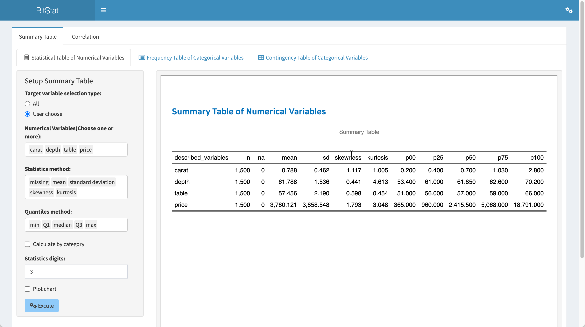

<br>

#### Statistical table of numeric variables by category

If you check the `Calculate by category` check box, you can calculate the statistical table of numeric variables for each level of the selected categorical variable.

If you check the `Calculate by category` check box, a widget called `Categorical variables:` is displayed. Here you select the categorical variable `cut`.

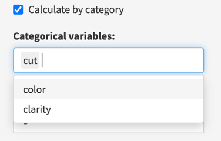

<br>

The settings for the statistical table are now defined as:

- Target variable selection type:
    - User choose
- Numerical Variables(Choose one or more):
    - `caret`, `depth`, `table`, `price`
- Statistics method:
    - `mean`, `standard deviation`, `skeweness`, `kurtosis`
- Quantiles method:
    - `min`, `Q1`, `median`, `Q3`, `max`
- Calculate by category
    - checked
- Categorical variables:  
    - `cut`
- Statistics digits:
    - 3

When executed under the above conditions, the following statistical table is output.

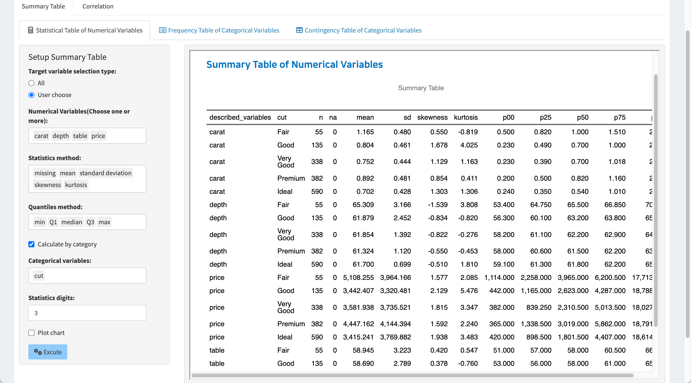

<br>

#### Statistical table with visualization

Since the statistics table consists of several statistics, it is not easy to understand the distribution of the corresponding numeric variable. However, with visualization, it becomes easier to understand the distribution of numerical variables.

If you check the `Plot chart` check box, a `density plot` is output after the statistical table to understand the distribution of numerical variables.

The following is the result when the `Plot chart` check box is checked. Density plots are visualized for each selected numeric variable along with a statistical table.


<br>

If you check the `Plot chart` check box and select a categorical variable, a density plot of the numeric variable is created, separated by level of the selected categorical variable.

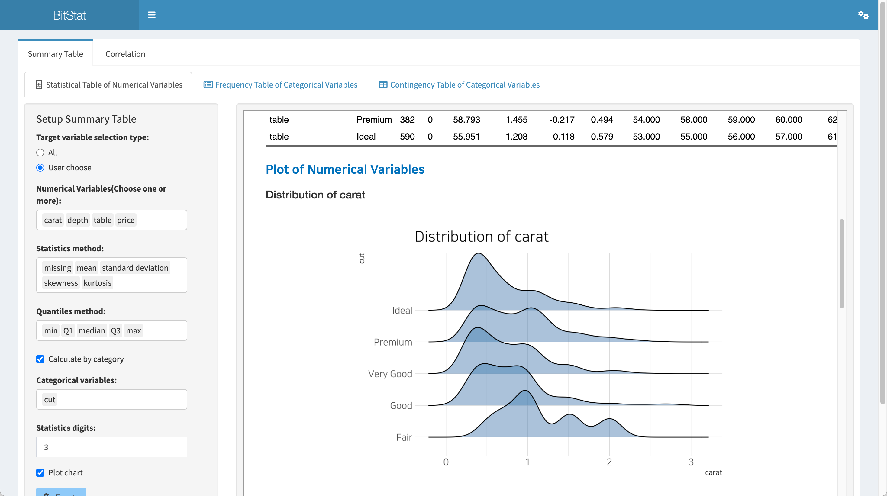


<br>
```{r, sol-1, echo=FALSE}
div(class = "bg-blue", 
    h4(icon("lightbulb", style = "margin-right: 5px;"), 
       "Solution", style = "margin-bottom: 10px; margin-top: 0px;"), 
    "According to the definition of multiple conditions, results from various viewpoints are output on one screen, so it is necessary to learn how to use individual input widgets. If the number of data is small, it runs with the default settings. Then change the condition to see how the result changes.")
```

<br>

### Frequency Table of Categorical Variables

Create frequency tables of categorical variables and visualize their distributions.

The frequency table function is accessed through the menu of **Descriptive Statistics > Summary Table > Frequency Table of Categorical Variables**.

<br>

#### Input widget for frequency table

- Target variable selection type:
    - Select one from `All` and `Custom` with the radio button.
    - All
        - By default, all categorical variables are selected for analysis.
    - User choose
        - The user selects a categorical variable to analyze.
        - If user selection is checked, 
        - a list box of `Categorical Variables(Choose one or more):` will appear.
- Categorical Variables(Choose one or more):
    - Appears only when `User choose` is specified in `Target variable selection type:`.
    - You can select one or more variables from any categorical variable.
- Plot chart
    - Select whether to output a 'bar plot' that can identify the distribution of categorical variables along with the frequency table.
    - If the check box is checked, the plot is also output.    

<br>

#### Frequency table of default settings

As the default setting of Descriptive Statistics > Summary Table > Frequency Table of Categorical Variables, if you click the `Execute` button, the **frequency table** is output in the right result area.

The settings for the frequency table are now defined as:

- Target variable selection type:
    - All
- Plot chart
    - not checked

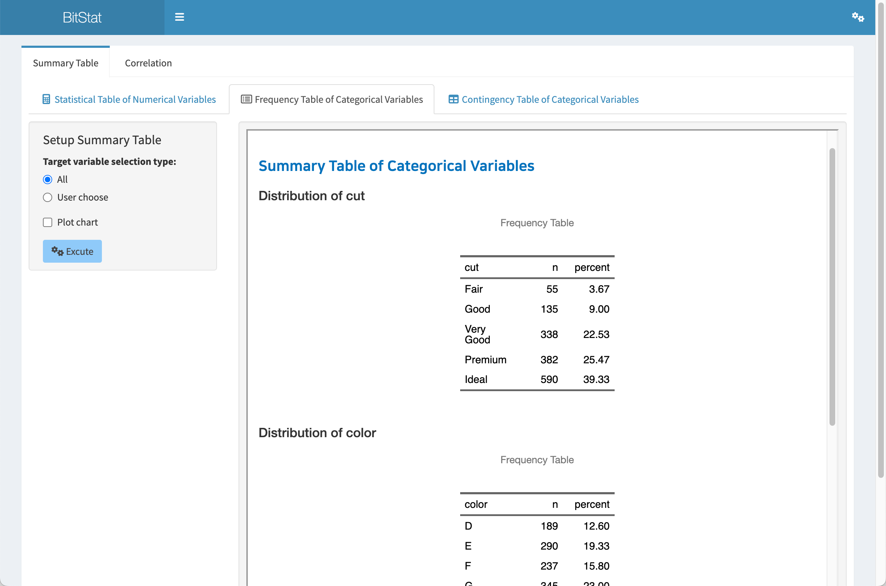

<br>


#### Frequency table with visualization

If you check the `Plot chart` check box, a `bar plot` is output after the frequency table to understand the distribution of categorical variables.

The following is the result when the `Plot chart` check box is checked. Bar plots are visualized for each selected categorical variable along with a frequency table.

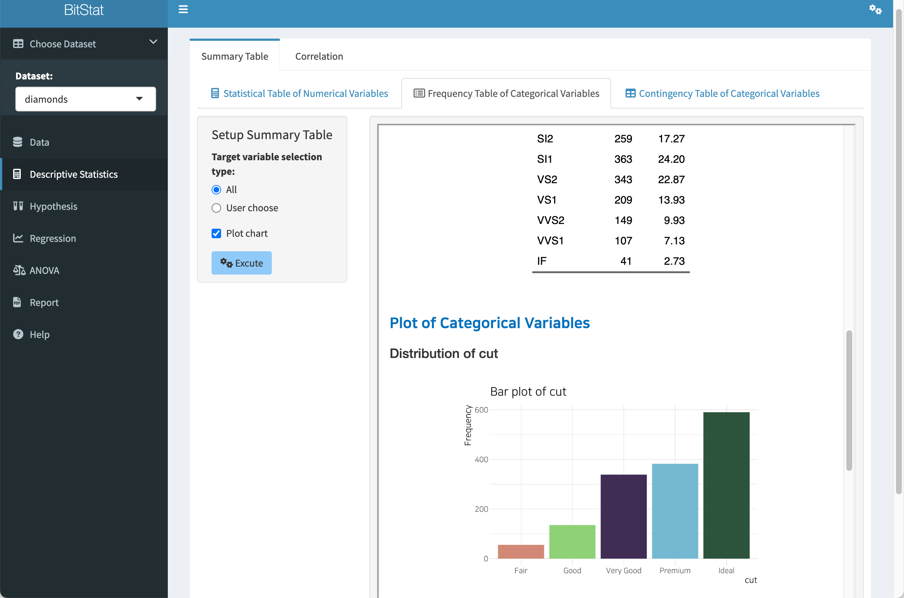

<br>

### Contingency Table of Categorical Variables

Compute the contingency table of two categorical variables and visualize the distribution.

The contingency table function is accessed through the menu of **Descriptive Statistics > Summary Table > Contingency Table of Categorical Variables**.

<br>

#### Input widget for contingency table

- Row variable (select one):
    - Select one categorical variable to place in a row of the contingency table.
- Column variable (select one):
    - Select one categorical variable to place in a column of the contingency table.
- Whether the marginal sum
    - Select whether to output marginal values to the created contingency table.
    - If the check box is checked, a list box of `Type of marginal sum:` is displayed.
- Type of marginal sum:
    - Select the aggregation method to output to the marginal sum of the contingency table.
    - Choose one from `Marginal sum`, `Row percentages`, `Column percentages`, `Percentages of total`.
    - `Marginal sum` is selected by default.    
- Plot chart
    - Select whether to output a 'mosaic plot' that can identify the distribution of two categorical variables along with the contingency table.
    - If the check box is checked, the plot is also output.    
<br>

#### Contingency table of default selection

As the default setting of `Descriptive Statistics > Summary Table > Contingency Table of Categorical Variables`, click the `Execute` button to output **contingency table for two categorical variables** in the right result area.

The settings for the contingency table are now defined as:

- Row variable (select one):
    - `cut`
- Column variable (select one):  
    - `color`
- Whether the marginal sum
    - Not checked
- Plot chart
    - Not checked
    
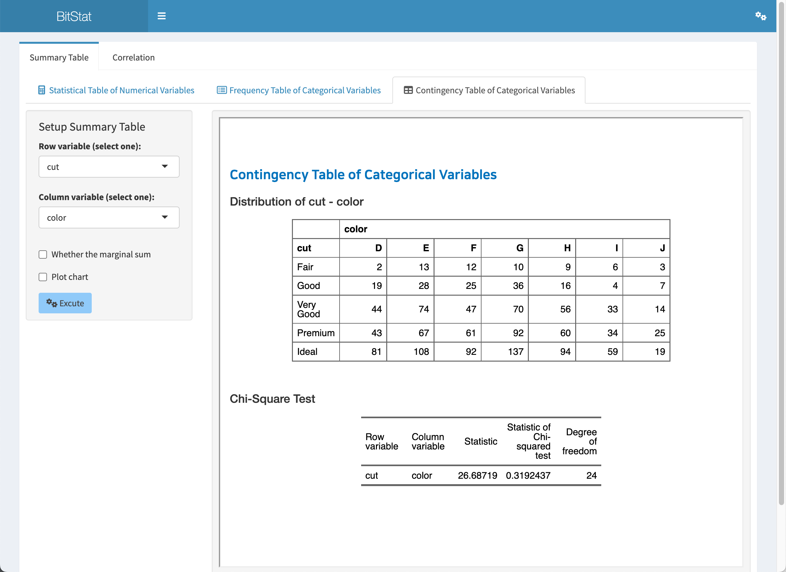


<br>

#### Contingency table with marginal sum

You can add marginal sums for aggregation of individual rows/columns to a contingency table.

- Row variable (select one):
    - `cut`
- Column variable (select one):  
    - `color`
- Whether the marginal sum
    - Checked
- Type of marginal sum:
    - `Marginal sum`
- Plot chart
    - Not checked
    
The contingency table executed under the above conditions is output as follows.

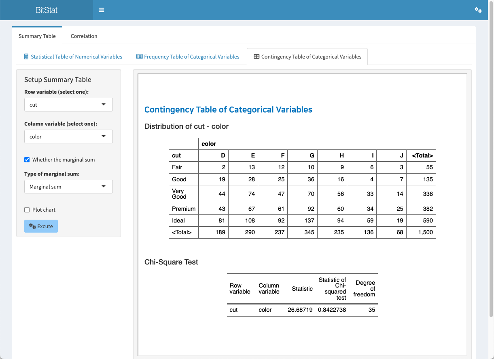

<br>

#### Contingency table with visualization

If you check the `Plot chart` check box, you can output a `mosaic plot` that can identify the distribution of two categorical variables.

The following is the result when the `Plot chart` check box is checked. A plot is output to determine the distribution of the two categorical variables output as a contingency table.

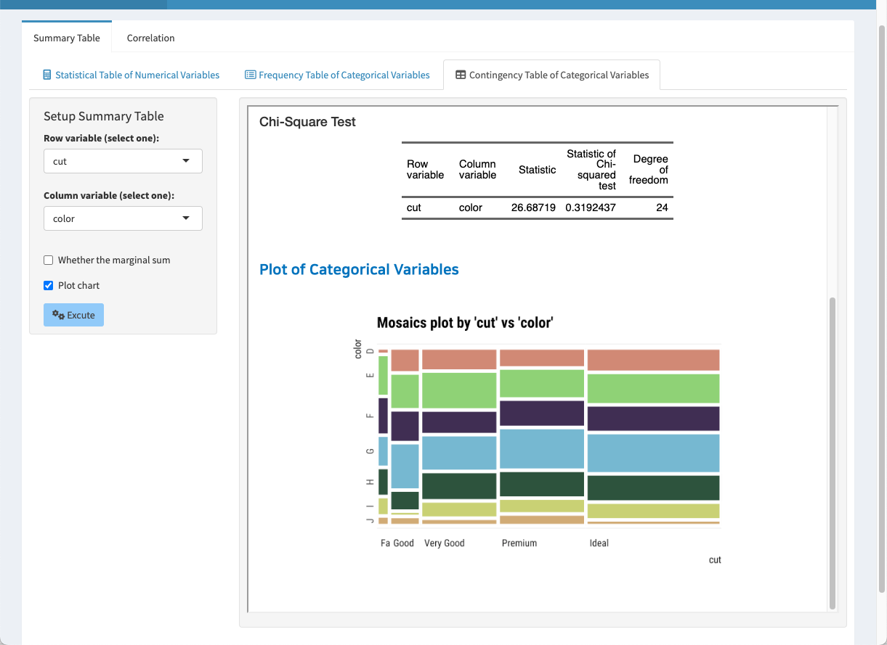


