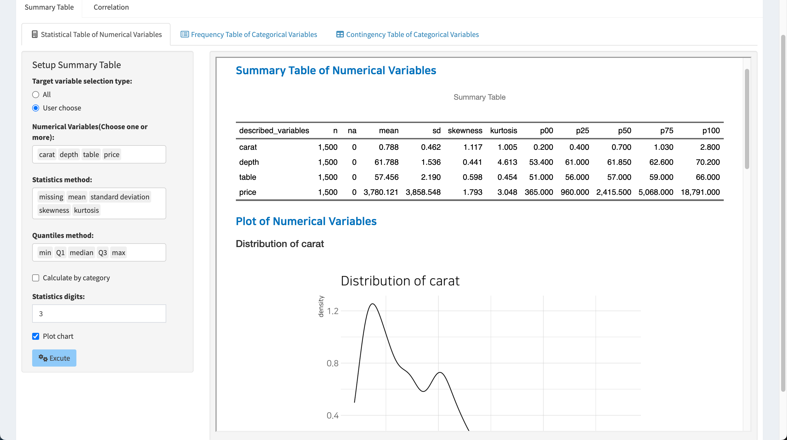
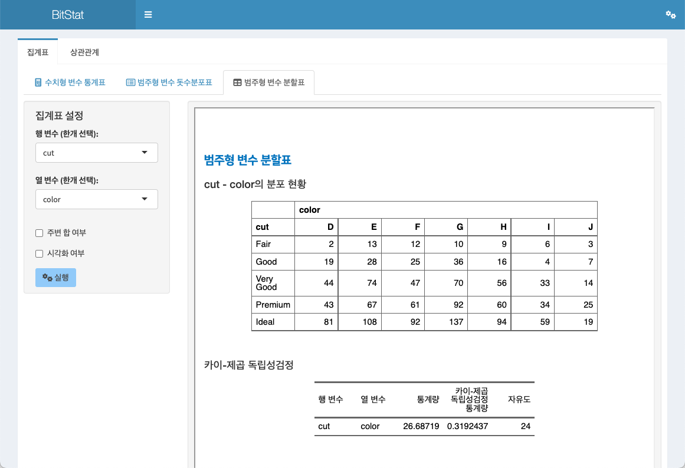
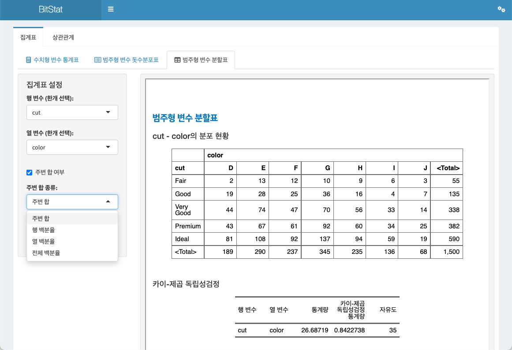

```{r setup, echo=FALSE, cache=FALSE}
library(shiny)
library(htmltools)
```


```{r, preface, echo=FALSE}
div(class = "preface", 
    h4("Preface"),
    "It covers how to aggregate uploaded or stored data.", br(),
    "Describes how to perform summary aggregation and visualization by characteristics of numeric and categorical variables.")
```

<br>

## Fuction of Summary Table

In the `Summary Table` menu, numerical variables are aggregated into **statistical tables**, and categorical variables are aggregated into **frequency tables** and **contingency tables**. And it is visualized to easily understand the distribution of variables.

- Statistical Table of Numerical Variables
- Frequency Table of Categorical Variables
- Contingency Table of Categorical Variables

### Statistical Table of Numerical Variables

Create statistical tables of numeric variables and visualize their distributions.

The summary table function is accessed through the menu system of **Descriptive Statistics > Summary Table > Statistical Table of Numerical Variables**.

<br>

#### Input widget for aggregation

- Target variable selection type:
    - Select one from `All` and `Custom` with the radio button.
    - All
        - By default, all numeric variables are selected for analysis.
    - User choose
        - The user selects a numeric variable to analyze.
        - If user selection is checked, 
        - a list box of `Numerical Variables(Choose one or more):` will appear.
- Numerical Variables(Choose one or more):
    - Appears only when `User choose` is specified in `Target variable selection type:`.
    - You can select one or more variables from any numeric variable.
- Statistics method:
    - Select the statistics to output to the summary table.
    - Choose from `missing`, `mean`, `standard deviation`, `skeweness`, `kurtosis`, `observation`, `SEM`, `IQR`.
    - `mean`, `standard deviation`, `skeweness`, `kurtosis` are selected by default.
- Quantiles method:
    - Select the quantiles to output to the summary table.
    - `min`, `Q1`, `median`, `Q3`, `max`, `1%th`, `5%th`, `10%th`, `20%th`, `30%th`, `40%th`, `60%th`, `70%th`, `80%th`, `90%th`, `95%th`, `99%th`에서 선택합니다.
    - `min`, `Q1`, `median`, `Q3`, `max` are selected by default.
- Calculate by category
    - This is a function that calculates a statistical table of numeric variables by grouping them by level of categorical variables.
    - Checking the check box widget will bring up the 'Categorical variables:' for categorical calculations.
- Categorical variables:
    - This function calculates the ssummary table of numeric variables by grouping them by level of categorical variables.
- Statistics digits:
    - Specifies the number of decimal places for the calculated statistics.
    - The default is 3, which is user-selectable.
- Plot chart
    - Select whether to output a 'density plot' that can identify the distribution of numerical variables along with the statistical table.
    - If the check box is checked, the plot is also output.

<br>

#### Statistical table by default setting

Here, outputting a statistical table from the `Statistical Table of Numerical Variables` is assuming that `diamonds` data is selected in the `Dataset:` list box.

As the default setting of Descriptive Statistics > Summary Table > Statistical Table of Numerical Variables, if you click the `Execute` button, the **statistical table** is output in the right result area.

These default settings are:

- Target variable selection type:
    - All
- Statistics method:
    - `mean`, `standard deviation`, `skeweness`, `kurtosis`
- Quantiles method:
    - `min`, `Q1`, `median`, `Q3`, `max`
- Statistics digits:
    - 3


<br>

#### Statistical table by user-selected selection

Instead of all numeric variables, the user can select a numeric variable. This example selects the variables `caret`, `depth`, `table` and `price`.


<br>

The settings for the statistical table are now defined as follows:

- Target variable selection type:
    - User choose
- Numerical Variables(Choose one or more):
    - `caret`, `depth`, `table`, `price`
- Statistics method:
    - `mean`, `standard deviation`, `skeweness`, `kurtosis`
- Quantiles method:
    - `min`, `Q1`, `median`, `Q3`, `max`
- Statistics digits:
    - 3
  
When executed under the above conditions, the following statistical table is output.


<br>

#### Statistical table of numeric variables by category

If you check the `Calculate by category` check box, you can calculate the statistical table of numeric variables for each level of the selected categorical variable.

If you check the `Calculate by category` check box, a widget called `Categorical variables:` is displayed. Here you select the categorical variable `cut`.


<br>

The settings for the statistical table are now defined as:

- Target variable selection type:
    - User choose
- Numerical Variables(Choose one or more):
    - `caret`, `depth`, `table`, `price`
- Statistics method:
    - `mean`, `standard deviation`, `skeweness`, `kurtosis`
- Quantiles method:
    - `min`, `Q1`, `median`, `Q3`, `max`
- Calculate by category
    - checked
- Categorical variables:  
    - `cut`
- Statistics digits:
    - 3

When executed under the above conditions, the following statistical table is output.


<br>

#### Statistical table with visualization

Since the statistics table consists of several statistics, it is not easy to understand the distribution of the corresponding numeric variable. However, with visualization, it becomes easier to understand the distribution of numerical variables.

If you check the `Plot chart` check box, a `density plot` is output after the statistical table to understand the distribution of numerical variables.

The following is the result when the `Plot chart` check box is checked. Density plots are visualized for each selected numeric variable along with a statistical table.



<br>

If you check the `Plot chart` check box and select a categorical variable, a density plot of the numeric variable is created, separated by level of the selected categorical variable.


<br>
```{r, sol-1, echo=FALSE}
div(class = "bg-blue", 
    h4(icon("lightbulb", style = "margin-right: 5px;"), 
       "Solution", style = "margin-bottom: 10px; margin-top: 0px;"), 
    "According to the definition of multiple conditions, results from various viewpoints are output on one screen, so it is necessary to learn how to use individual input widgets. If the number of data is small, it runs with the default settings. Then change the condition to see how the result changes.")
```

<br>

### Frequency Table of Categorical Variables

Create frequency tables of categorical variables and visualize their distributions.

통계표 기능은 **기술통계 > 집계표 > 범주형 변수 돗수분포표**의 메뉴 체계로 접근합니다.

<br>

#### 돗수분포표를 위한 입력 위젯

- 대상변수 선택 방법:
    - 레디오 버튼으로 `전체`와 `사용자 선택`에서 하나를 선택합니다.
    - 전체
        - 기본 설정값으로 모든 범주형 변수를 분석 대상으로 선정합니다.
    - 사용자 선택
        - 사용자가 분석할 범주형 변수를 선택합니다.
        - 사용자 선택을 체크하면, 
        - `범주형 변수 목록(하나이상 선택):` 리스트 박스가 나타납니다.
- 범주형 변수 목록(하나이상 선택):
    - `대상변수 선택 방법:`에서 `사용자 선택`을 지정했을 때만 나타납니다.
    - 모든 범주형 변수에서 하나 이상의 변수를 선택할 수 있습니다.
- 시각화 여부
    - 돗수분포표와 함께, 범주형 변수의 분포를 파악할 수 있는 `막대그래프(bar plot)`을 함께 출력할지의 여부를 선택합니다.
    - 체크박스를 체크하면 플롯도 함께 출력됩니다.

<br>

#### 기본 돗수분포표 출력

`범주형 변수 돗수분포표`에서 돗수분포표를 출력하는 방법은 `데이터셋:` 리스트박스에서 `diamonds` 데이터를 선택을 전제로 소개합니다.

기술통계 > 집계표 > 범주형 변수 돗수분포표의 기본 설정으로 `실행` 버튼을 클릭하면 오른쪽 결과 영역에 **범주형 변수의 돗수분포표**가 출력됩니다.

이 기본 설정은 다음과 같습니다.

- 대상변수 선택 방법:
    - 전체
- 시각화 여부
    - 미 체크


<br>

### 범주형 변수 분할표

두 범주형 변수의 분할표(contingency table)를 작성하고 분포를 시각화합니다.

통계표 기능은 **기술통계 > 집계표 > 범주형 변수 분할표**의 메뉴 체계로 접근합니다.

<br>

#### 분할표를 위한 입력 위젯

- 행 변수 (한개 선택):
    - 분할표에세 행에 배치할 범주형 변수를 하나를 선택합니다.
- 열 변수 (한개 선택):      
    - 분할표에세 열에 배치할 범주형 변수를 하나를 선택합니다.
- 주변 합 여부
    - 생성한 분할표에 주변 합(marginal) 값의 출력 여부를 선택합니다.
    - 체크 박스에 체크하면, `주변 합 종류:` 리스트 박스가 출력됩니다.
- 주변 합 종류:
    - 분할표의 주변합에 출력할 집계 방법을 선택합니다.
    - `주변 합`, `행 백분율`, `열 백분율`, `전체 백분율`에서 하나를 선택합니다.
    - 기본값은 `주변 합`입니다.
- 시각화 여부
    - 분할표와 함께, 두 범주형 변수의 분포를 파악할 수 있는 `모자이크플롯(mosaic plot)`을 함께 출력할지의 여부를 선택합니다.
    - 체크박스를 체크하면 플롯도 함께 출력됩니다.

<br>

#### 기본 분할표 출력

기술통계 > 집계표 > 범주형 변수 분할표의 기본 설정으로 `실행` 버튼을 클릭하면 오른쪽 결과 영역에 **두 범주형 변수의 분할표**가 출력됩니다.

이 기본 설정은 다음과 같습니다.

- 행 변수 (한개 선택):
    - `cut`
- 열 변수 (한개 선택):      
    - `color`
- 주변 합 여부
    - 미 체크
- 시각화 여부
    - 미 체크
    



<br>

#### 주변합 포함 분할표 출력

분할표에 개별 행/열의 집계를 위한 주변 합을 추가할 수 있습니다.

- 행 변수 (한개 선택):
    - `cut`
- 열 변수 (한개 선택):      
    - `color`
- 주변 합 여부
    - 체크
- 주변 합 종류:
    - `주변 합`
- 시각화 여부
    - 미 체크
    
상기 조건으로 실행하면 다음과 같은 분할표가 출력됩니다.



<br>

#### 시각화와 함께 분할표 출력

`시각화 여부` 체크 박스를 체크하면, 두 범주형 변수의 분포를 파악할 수 있는 `모자이크플롯(mosaic plot)`을 함께 출력할 수 있습니다.

다음은 `시각화 여부` 체크 박스를 체크한 경우의 결과입니다. 분할표로 출력된 두 범주형 변수의 분포를 파악할 수 있는 플롯이 출력됩니다.


