```{r setup, echo=FALSE, cache=FALSE}
library(shiny)
library(htmltools)
```


```{r, preface, echo=FALSE}
div(class = "preface", 
    h4("들어가기"),
    "업로드한 데이터나 저장된 데이터를 집계하는 방법을 다룹니다.", br(),
    "수치형 변수와 범주형 변수의 특성별로 요약 집계와 시각화를 수행하는 방법을 설명합니다.")
```

<br>

## 집계표 기능

`집계표` 메뉴에서는 수치형 변수의 **통계표**와 범주형 변수의 **돗수분포표, 분할표**를 작성하고 시각화합니다.

- 수치형 변수 통계표
- 범주형 변수 돗수분포표
- 범주형 변수 분할표

### 수치형 변수 통계표

수치형 변수의 통계표를 작성하고 분포를 시각화합니다.

통계표 기능은 **기술통계 > 집계표 > 수치형 변수 통계표**의 메뉴 체계로 접근합니다.

<br>

#### 집계를 위한 입력 위젯

- 대상변수 선택 방법:
    - 레디오 버튼으로 `전체`와 `사용자 선택`에서 하나를 선택합니다.
    - 전체
        - 기본 설정값으로 모든 수치형 변수를 분석 대상으로 선정합니다.
    - 사용자 선택
        - 사용자가 분석할 수치형 변수를 선택합니다.
        - 사용자 선택을 체크하면, 
        - `수치형 변수 목록(하나이상 선택):` 리스트 박스가 나타납니다.
- 수치형 변수 목록(하나이상 선택):
    - `대상변수 선택 방법:`에서 `사용자 선택`을 지정했을 때만 나타납니다.
    - 모든 수치형 변수에서 하나 이상의 변수를 선택할 수 있습니다.
- 통계량 종류:
    - 집계 테이블에 출력할 통계량을 선택합니다.
    - `결측치수`, `산술평균`, `표준편차`, `왜도`, `첨도`, `관측치수`, `표준오차`, `사분위수범위`에서 선택합니다.
    - `결측치수`, `산술평균`, `표준편차`, `왜도`, `첨도`가 기본 선택됩니다.
- 분위수 종류:
    - 집계 테이블에 출력할 분위수를 선택합니다.
    - `최솟값`, `1/4분위`, `중위수`, `3/4분위`, `최댓값`, `1%분위`, `5%분위`, `10%분위`, `20%분위`, `30%분위`, `40%분위`, `60%분위`, `70%분위`, `80%분위`, `90%분위`, `95%분위`, `99%분위`에서 선택합니다.
    - `최솟값`, `1/4분위`, `중위수`, `3/4분위`, `최댓값`이 기본 선택됩니다.
- 범주별 계산
    - 수치형 변수의 통계표를 범주형 변수들의 레벨별로 그룹핑하여 계산하는 기능입니다.
    - 체크박스 위젯으로 체크하면 범주별 계산을 위한 `범주형 변수 목록:`이 나타납니다.
- 범주형 변수 목록:
    - 수치형 변수의 통계표를 범주형 변수들의 레벨별로 그룹핑할 범주형 변수를 선택합니다. 하나 이상의 범주형 변수를 선택할 수 있습니다.
- 통계량 소수점 자리수:
    - 계산된 통계량의 소수점 이하 자리수를 지정합니다.
    - 기본값은 3이며, 사용자가 선택할 수 있습니다.
- 시각화 여부
    - 통계표와 함께, 수치형 변수의 분포를 파악할 수 있는 `밀도플롯(density plot)`을 함께 출력할지의 여부를 선택합니다.
    - 체크박스를 체크하면 플롯도 함께 출력됩니다.

<br>

#### 기본 통계표 출력

`수치형 변수 통계표`에서 통계표를 출력하는 방법은 `데이터셋:` 리스트박스에서 `diamonds` 데이터를 선택을 전제로 소개합니다.

기술통계 > 집계표 > 수치형 변수 통계표의 기본 설정으로 `실행` 버튼을 클릭하면 오른쪽 결과 영역에 **수치형 변수 집계 테이블**이 출력됩니다.

이 기본 설정은 다음과 같습니다.

- 대상변수 선택 방법:
    - 전체
- 통계량 종류:
    - `결측치수`, `산술평균`, `표준편차`, `왜도`, `첨도`
- 분위수 종류:
    - `최솟값`, `1/4분위`, `중위수`, `3/4분위`, `최댓값`
- 통계량 소수점 자리수:  
    - 3

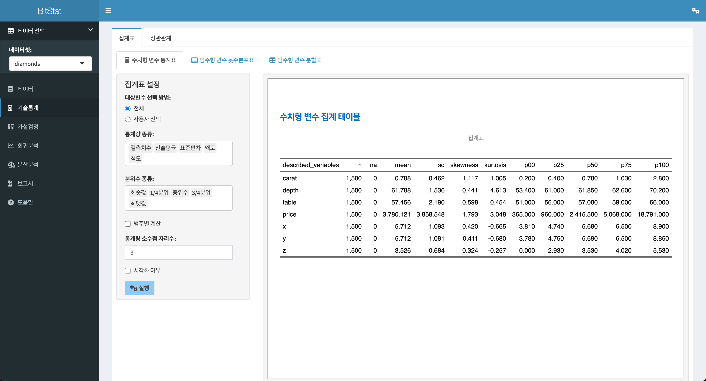

<br>

#### 사용자 변수선택 통계표 출력

전체 수치형 변수가 아닌, 사용자가 출력할 수치형 변수를 선택할 수 있습니다. 이 예제에서는 `caret`, `depth`, `table`, `price` 변수를 선택합니다.

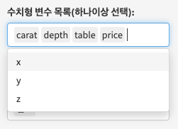
<br>

이제 집계 테이블을 위한 설정은 다음과 같이 정의되었습니다.

- 대상변수 선택 방법:
    - 사용자 선택
- 수치형 변수 목록(하나이상 선택):
    - `caret`, `depth`, `table`, `price`
- 통계량 종류:
    - `결측치수`, `산술평균`, `표준편차`, `왜도`, `첨도`
- 분위수 종류:
    - `최솟값`, `1/4분위`, `중위수`, `3/4분위`, `최댓값`
- 통계량 소수점 자리수:  
    - 3
  
상기 조건으로 실행하면 다음과 같은 집계 테이블이 출력됩니다.

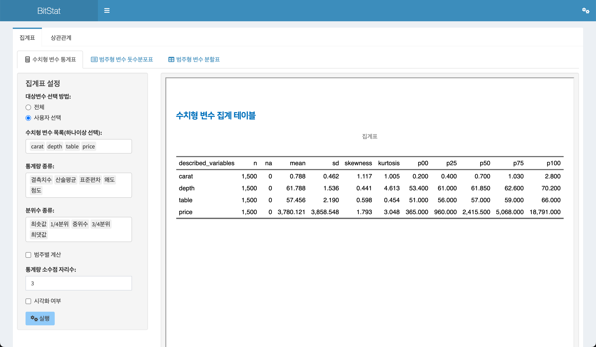

<br>

#### 범주별 수치형 변수 통계표 출력

`범주별 계산` 체크 박스를 체크하면, 선택한 범주형 변수의 수준(levels)별로 수치형 변수의 통계표를 계산할 수 있습니다.

다음 그림처럼 `범주별 계산` 체크 박스를 체크하여 나타난 `범주형 변수 목록:`에서 범주형 변수인 `cut`을 선택합니다.

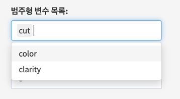

<br>

이제 집계 테이블을 위한 설정은 다음과 같이 정의되었습니다.

- 대상변수 선택 방법:
    - 사용자 선택
- 수치형 변수 목록(하나이상 선택):
    - `caret`, `depth`, `table`, `price`
- 통계량 종류:
    - `결측치수`, `산술평균`, `표준편차`, `왜도`, `첨도`
- 분위수 종류:
    - `최솟값`, `1/4분위`, `중위수`, `3/4분위`, `최댓값`
- 범주별 계산
    - 체크
- 범주형 변수 목록:    
    - `cut`
- 통계량 소수점 자리수:  
    - 3

상기 조건으로 실행하면 다음과 같은 집계 테이블이 출력됩니다.

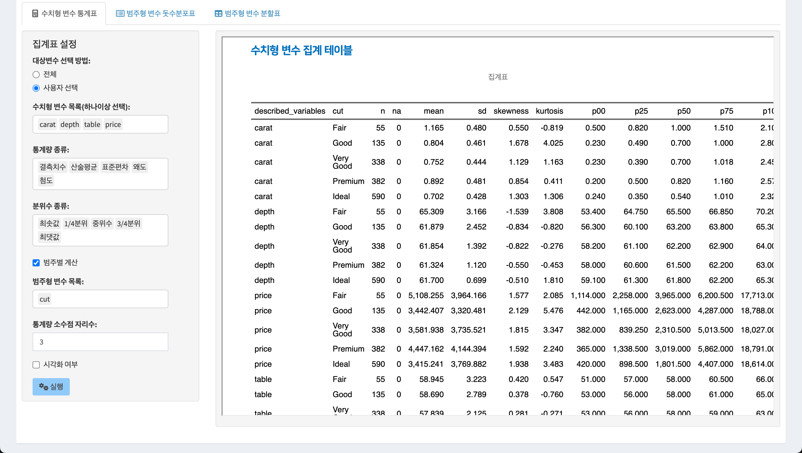

<br>

#### 시각화와 함께 통계표 출력

집계 테이블은 여러 통계량으로 구성된 테이블이기 때문에, 해당 수치형 변수의 분포를 파악는 것은 쉽지 않습니다. 그런데 시각화와 함께 한다면 수치형 변수의 분포를 파악하기 수월해집니다.

`시각화 여부` 체크 박스를 체크하면, 수치형 변수의 분포를 파악할 수 있는 `밀도플롯(density plot)`을 함께 출력할 수 있습니다.

다음은 `시각화 여부` 체크 박스를 체크한 경우의 결과입니다. 집계 테이블에 출력된 수치형 변수의 개수만큼의 플롯이 출력됩니다.

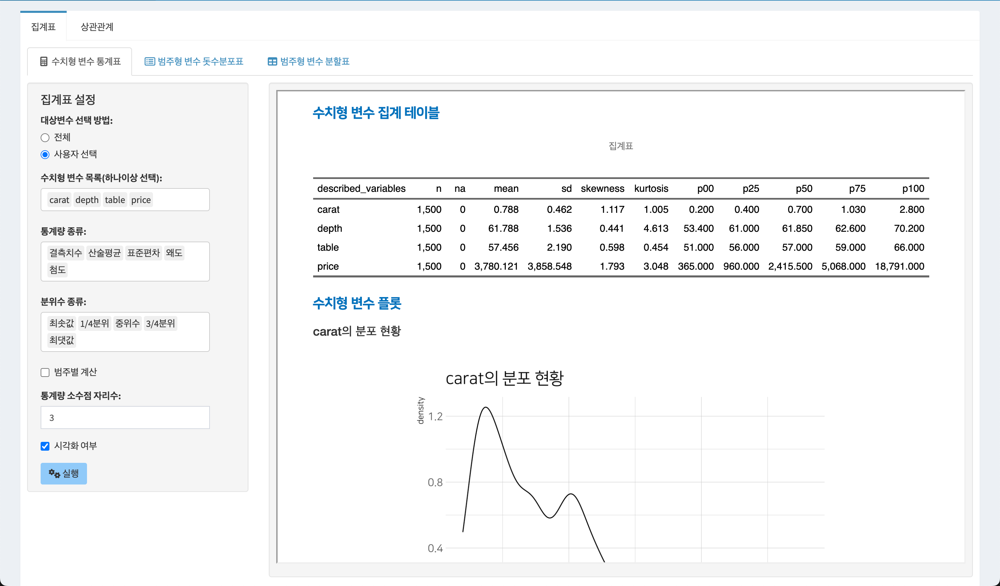

<br>

`시각화 여부` 체크 박스를 체크하고 범주별 변수를 선택한다면, 다음처럼 선택한 범주의 수준별로 수치형 변수의 밀도플롯이 개별 수치형 변수의 개수만큼 출력됩니다.

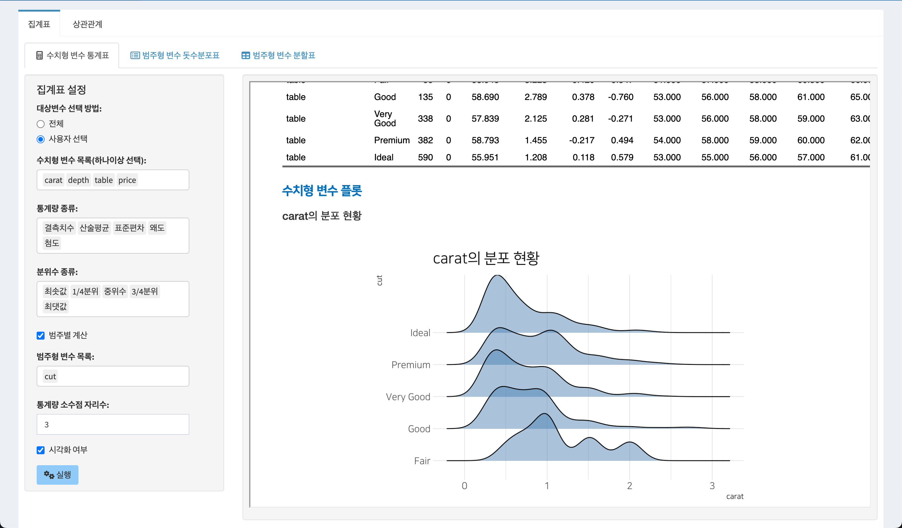


<br>
```{r, sol-1, echo=FALSE}
div(class = "bg-blue", 
    h4(icon("lightbulb", style = "margin-right: 5px;"), 
       "솔루션", style = "margin-bottom: 10px; margin-top: 0px;"), 
    "하나의 단위 기능 화면에서 여러 조건의 정의에 따라서 다양한 관점의 결과가 출력되므로, 개별 입력 위젯의 사용법을 익히는 것이 필요합니다. 데이터의 건수가 적다면 기본 설정으로 최초 실행한 후 조건을 변경하면서 결과의 변화를 파악하는 것도 좋습니다.")
```

<br>

### 범주형 변수 돗수분포표

범주형 변수의 돗수분포표(frequency table)를 작성하고 분포를 시각화합니다.

통계표 기능은 **기술통계 > 집계표 > 범주형 변수 돗수분포표**의 메뉴 체계로 접근합니다.

<br>

#### 돗수분포표를 위한 입력 위젯

- 대상변수 선택 방법:
    - 레디오 버튼으로 `전체`와 `사용자 선택`에서 하나를 선택합니다.
    - 전체
        - 기본 설정값으로 모든 범주형 변수를 분석 대상으로 선정합니다.
    - 사용자 선택
        - 사용자가 분석할 범주형 변수를 선택합니다.
        - 사용자 선택을 체크하면, 
        - `범주형 변수 목록(하나이상 선택):` 리스트 박스가 나타납니다.
- 범주형 변수 목록(하나이상 선택):
    - `대상변수 선택 방법:`에서 `사용자 선택`을 지정했을 때만 나타납니다.
    - 모든 범주형 변수에서 하나 이상의 변수를 선택할 수 있습니다.
- 시각화 여부
    - 돗수분포표와 함께, 범주형 변수의 분포를 파악할 수 있는 `막대그래프(bar plot)`을 함께 출력할지의 여부를 선택합니다.
    - 체크박스를 체크하면 플롯도 함께 출력됩니다.

<br>

#### 기본 돗수분포표 출력

`범주형 변수 돗수분포표`에서 돗수분포표를 출력하는 방법은 `데이터셋:` 리스트박스에서 `diamonds` 데이터를 선택을 전제로 소개합니다.

기술통계 > 집계표 > 범주형 변수 돗수분포표의 기본 설정으로 `실행` 버튼을 클릭하면 오른쪽 결과 영역에 **범주형 변수의 돗수분포표**가 출력됩니다.

이 기본 설정은 다음과 같습니다.

- 대상변수 선택 방법:
    - 전체
- 시각화 여부
    - 미 체크

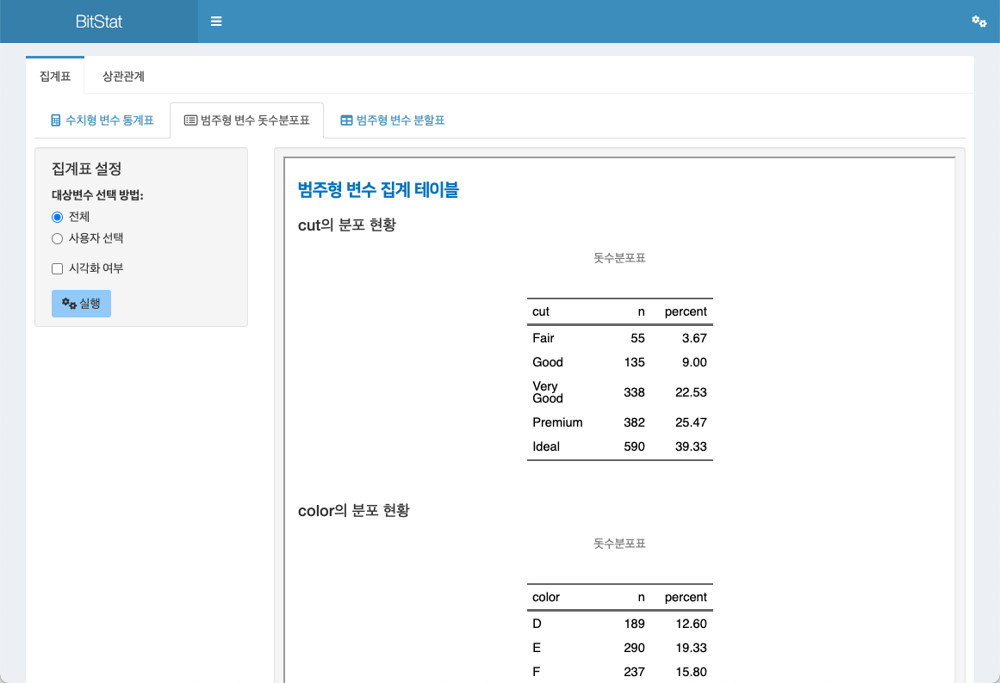

<br>

### 범주형 변수 분할표

두 범주형 변수의 분할표(contingency table)를 작성하고 분포를 시각화합니다.

통계표 기능은 **기술통계 > 집계표 > 범주형 변수 분할표**의 메뉴 체계로 접근합니다.

<br>

#### 분할표를 위한 입력 위젯

- 행 변수 (한개 선택):
    - 분할표에세 행에 배치할 범주형 변수를 하나를 선택합니다.
- 열 변수 (한개 선택):      
    - 분할표에세 열에 배치할 범주형 변수를 하나를 선택합니다.
- 주변 합 여부
    - 생성한 분할표에 주변 합(marginal) 값의 출력 여부를 선택합니다.
    - 체크 박스에 체크하면, `주변 합 종류:` 리스트 박스가 출력됩니다.
- 주변 합 종류:
    - 분할표의 주변합에 출력할 집계 방법을 선택합니다.
    - `주변 합`, `행 백분율`, `열 백분율`, `전체 백분율`에서 하나를 선택합니다.
    - 기본값은 `주변 합`입니다.
- 시각화 여부
    - 분할표와 함께, 두 범주형 변수의 분포를 파악할 수 있는 `모자이크플롯(mosaic plot)`을 함께 출력할지의 여부를 선택합니다.
    - 체크박스를 체크하면 플롯도 함께 출력됩니다.

<br>

#### 기본 분할표 출력

기술통계 > 집계표 > 범주형 변수 분할표의 기본 설정으로 `실행` 버튼을 클릭하면 오른쪽 결과 영역에 **두 범주형 변수의 분할표**가 출력됩니다.

이 기본 설정은 다음과 같습니다.

- 행 변수 (한개 선택):
    - `cut`
- 열 변수 (한개 선택):      
    - `color`
- 주변 합 여부
    - 미 체크
- 시각화 여부
    - 미 체크
    
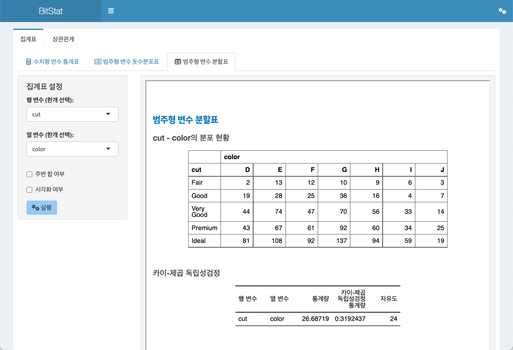


<br>

#### 주변합 포함 분할표 출력

분할표에 개별 행/열의 집계를 위한 주변 합을 추가할 수 있습니다.

- 행 변수 (한개 선택):
    - `cut`
- 열 변수 (한개 선택):      
    - `color`
- 주변 합 여부
    - 체크
- 주변 합 종류:
    - `주변 합`
- 시각화 여부
    - 미 체크
    
상기 조건으로 실행하면 다음과 같은 분할표가 출력됩니다.

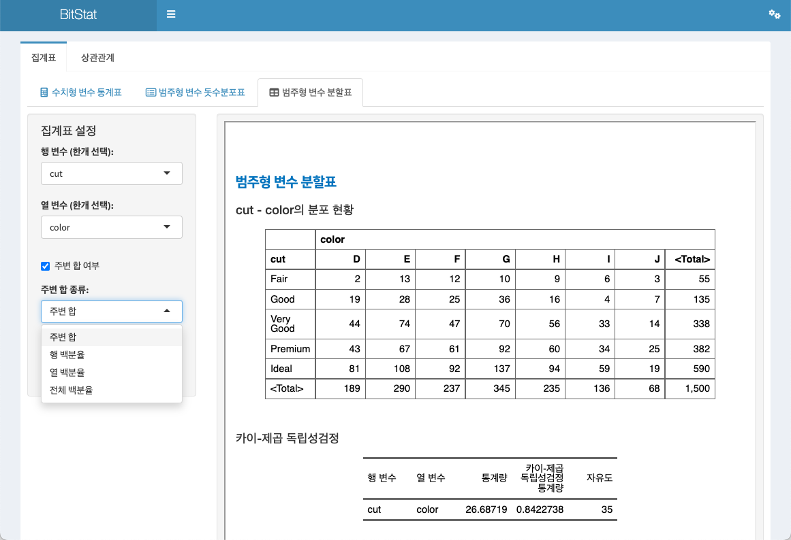

<br>

#### 시각화와 함께 분할표 출력

`시각화 여부` 체크 박스를 체크하면, 두 범주형 변수의 분포를 파악할 수 있는 `모자이크플롯(mosaic plot)`을 함께 출력할 수 있습니다.

다음은 `시각화 여부` 체크 박스를 체크한 경우의 결과입니다. 분할표로 출력된 두 범주형 변수의 분포를 파악할 수 있는 플롯이 출력됩니다.

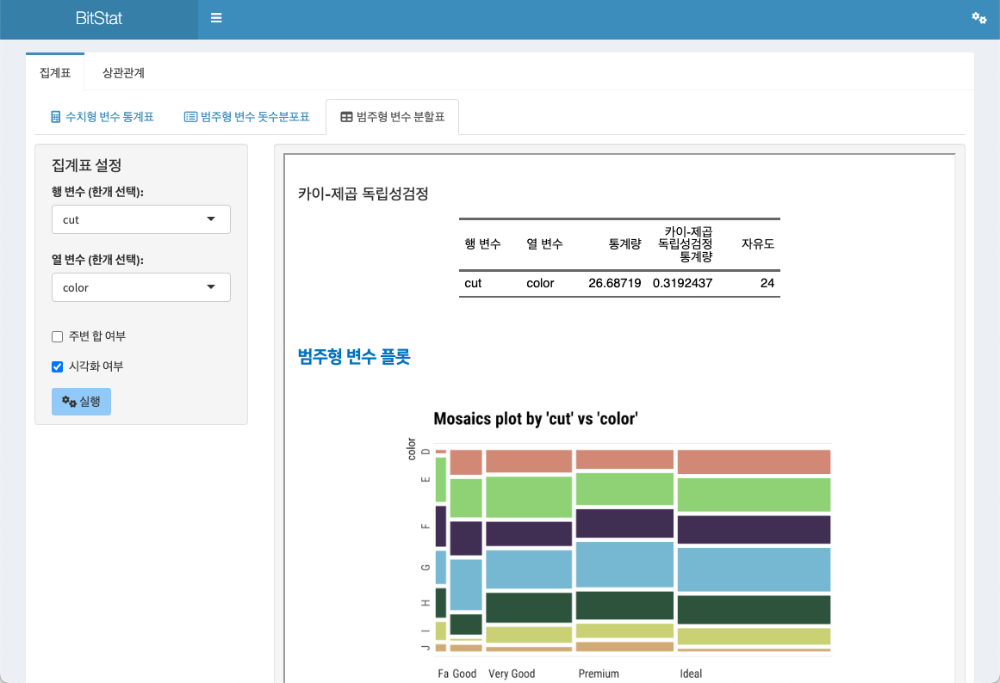


